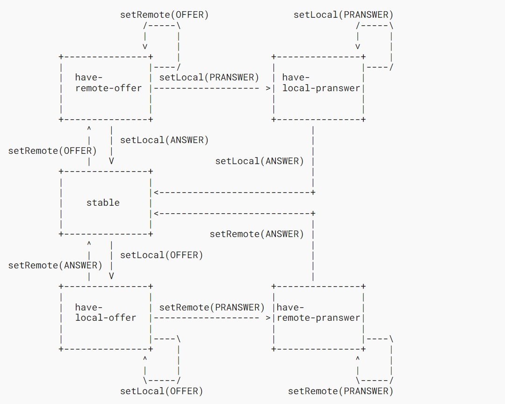
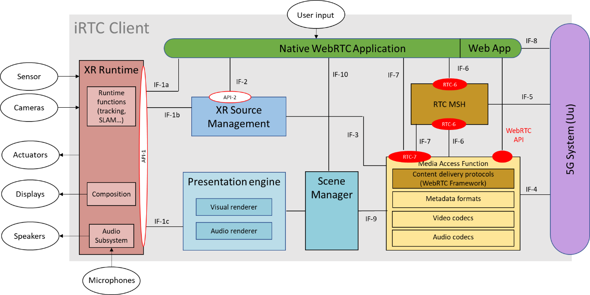
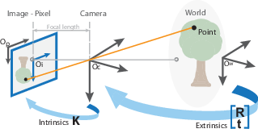

<table><thead><tr class="header"><th>3GPP TS 26.113 V19.1.0 (2025-09)</th><th></th></tr></thead><tbody><tr class="odd"><td>Technical Specification</td><td></td></tr><tr class="even"><td>
3rd Generation Partnership Project;

Technical Specification Group Services and System Aspects;

Real-Time Media Communication; Protocols and APIs

(Release 19)
</td><td></td></tr><tr class="odd"><td></td><td></td></tr><tr class="even"><td></td><td></td></tr><tr class="odd"><td></td><td></td></tr><tr class="even"><td>The present document has been developed within the 3rd Generation Partnership Project (3GPP TM) and may be further elaborated for the purposes of 3GPP. 
The present document has not been subject to any approval process by the 3GPP Organizational Partners and shall not be implemented. 
This Specification is provided for future development work within 3GPP only. The Organizational Partners accept no liability for any use of this Specification. 
Specifications and Reports for implementation of the 3GPP TM system should be obtained via the 3GPP Organizational Partners' Publications Offices.</td><td></td></tr></tbody></table>

<table><thead><tr class="header"><th></th></tr></thead><tbody><tr class="odd"><td><blockquote>
<em><strong>3GPP</strong></em>

Postal address

3GPP support office address

650 Route des Lucioles - Sophia Antipolis

Valbonne - FRANCE

Tel.: +33 4 92 94 42 00 Fax: +33 4 93 65 47 16

Internet

https://www.3gpp.org
</blockquote></td></tr><tr class="even"><td>
<em><strong>Copyright Notification</strong></em>

No part may be reproduced except as authorized by written permission. 
The copyright and the foregoing restriction extend to reproduction in all media.

© 2025, 3GPP Organizational Partners (ARIB, ATIS, CCSA, ETSI, TSDSI, TTA, TTC).

All rights reserved.

UMTS™ is a Trade Mark of ETSI registered for the benefit of its members

3GPP™ is a Trade Mark of ETSI registered for the benefit of its Members and of the 3GPP Organizational Partners 
LTE™ is a Trade Mark of ETSI registered for the benefit of its Members and of the 3GPP Organizational Partners

GSM® and the GSM logo are registered and owned by the GSM Association
</td></tr></tbody></table>

#  Contents

Foreword 7

1 Scope 9

2 References 9

3 Definitions of terms, symbols and abbreviations 10

3.1 Terms 10

3.2 Symbols 11

3.3 Abbreviations 11

4 Procedures for real-time media communication 12

4.1 General 12

4.2 Procedures for media session handling 12

4.2.1 Provisioning (RTC-1) procedures 12

4.2.2 Network media session handling (RTC-3, RTC-5) procedures 13

4.2.3 UE media session handling (RTC-6, RTC-11) procedures 13

4.3 Procedures for media content and signalling transport 14

4.3.1 Media transport (RTC-4m, RTC-12) procedures 14

4.3.1.1 General 14

4.3.1.2 Media transport procedures at RTC-4m and RTC‑12 14

4.3.2 Signalling (RTC-4s) procedures 14

4.3.3 Application interaction (RTC-7) procedures 15

5 General aspects of APIs 15

5.1 Usage of HTTP 15

5.1.1 HTTP protocol version 15

5.1.1.1 RTC AF 15

5.1.2 HTTP message bodies for API resources 15

5.1.3 Usage of HTTP headers 15

5.1.3.1 General 15

5.1.3.2 Media Session Handler identification 15

5.1.3.3 RTC AF identification 15

5.1.3.4 Support for conditional HTTP GET requests 16

5.1.3.5 Support for conditional HTTP POST, PUT, PATCH and DELETE requests 16

6 Provisioning interface (RTC-1) 16

6.1 General 16

6.2 Provisioning Sessions API 16

6.3 Real-time Media Communication provisioning API 17

6.4 Server Certificates Provisioning API 17

6.5 Edge Resources Provisioning API 17

6.6 Policy Templates Provisioning API 17

6.7 Metrics Reporting Provisioning API 17

6.8 Consumption Reporting Provisioning API 17

7 Media hosting interface (RTC-2) 18

8 RTC AS to RTC AF APIs (RTC-3) 18

9 Media-centric transport interface (RTC-4, RTC-12) 18

9.1 General 18

9.2 Media transport (RTC-4m, RTC-12) 18

9.3 Signalling exchange (RTC-4s) 18

10 Media Session Handling interface (RTC-5, RTC-3) 19

10.1 General 19

10.2 Service Access Information API 19

10.3 Dynamic Policy API 19

10.3.1 Introduction 19

10.3.2 Enabling PDU Set handling in dynamic policies 20

10.3.3 Enabling dynamically changing traffic characteristics marking in dynamic policies 22

10.3.3.1 Dynamically changing traffic characteristics marking for data bursts 22

10.3.3.2 Dynamically changing traffic characteristics marking for expedited data transfers 23

10.3.4 Enabling multiplexed media flow handling in dynamic policies 23

10.4 Network Assistance API 24

10.5 Metrics Reporting API 25

10.6 Consumption Reporting API 25

10.6.1 General 25

10.6.2 ConsumptionReport data type 25

10.6.3 ConsumptionReportingUnit type 25

11 Media session handling client API (RTC-6, RTC-11) 26

12 Media access client API (RTC-7, RTC-11) 26

13 Protocols of real-time media communication 26

13.1 General 26

13.2 WebRTC signalling protocol 26

13.2.1 General 26

13.2.2 Protocol and version identification 27

13.2.3 WebSocket URI structure 27

13.2.4 SWAP 27

13.2.4.1 Protocol and version identification 27

13.2.4.2 Transport 27

13.2.4.3 State machine 29

13.2.4.4 Message syntax and semantics 30

13.2.4.4.1 Common message fields 30

13.2.4.4.1.1 Source (source) 30

13.2.4.4.1.2 Message Identifier (messge\_id) 30

13.2.4.4.1.3 Message Type (message\_type) 31

13.2.4.4.2 Register message 31

13.2.4.4.2.1 Description 31

13.2.4.4.2.2 Parameters 31

13.2.4.4.3 Response message 32

13.2.4.4.3.1 Description 32

13.2.4.4.3.2 Parameters 32

13.2.4.4.4 Connect message 32

13.2.4.4.4.1 Description 32

13.2.4.4.4.2 Parameters 32

13.2.4.4.5 Accept message 32

13.2.4.4.5.1 Description 32

13.2.4.4.5.2 Parameters 32

13.2.4.4.6 Update message 33

13.2.4.4.6.1 Description 33

13.2.4.4.6.2 Parameters 33

13.2.4.4.7 Reject message 33

13.2.4.4.7.1 Description 33

13.2.4.4.7.2 Parameters 33

13.2.4.4.8 Close message 33

13.2.4.4.8.1 Description 33

13.2.4.4.8.2 Parameters 33

13.2.4.4.9 Application message 33

13.2.4.4.9.1 Description 33

13.2.4.4.9.2 Parameters 33

13.2.4.5 Integrity and security 34

13.2.4.6 JSON schema 34

13.2.4.7 Protocol operation 35

14 Packet loss handling 36

14.1 Packet loss handling mechanisms in RTC endpoints 36

14.1.1 Video 36

14.1.1.1 General 36

14.1.1.2 NACK messages 36

14.1.1.3 PLI message 36

14.1.1.4 SLI message 36

14.1.1.5 FIR message 37

14.1.1.6 Temporal-Spatial Trade-Off Request (TSTR) 37

14.1.1.7 Temporary Maximum Media Stream Bit Rate Request (TMMBR) 37

14.1.1.8 RTP retransmission 37

14.2 Packet-loss handling mechanisms supported in RTC endpoint 38

14.2.1 General 38

14.2.2 Video 38

14.2.2.1 General 38

14.2.2.2 NACK, PLI, SLI and FIR messages 38

14.2.2.3 TMMBR and TMMBN messages 39

14.2.2.4 RTP retransmission 39

15 RTC QoE metrics reporting protocol 39

15.1 General 39

15.2 Quality of Experience metrics definition 39

15.2.1 Introduction 39

15.2.2 Corruption duration metric 39

15.2.3 Successive loss of RTP packets 40

15.2.4 Frame rate 41

15.2.5 Jitter duration 41

15.2.6 Sync loss duration 42

15.2.7 Round-trip time 43

15.2.8 Average codec bit rate 43

15.3 Quality metrics reporting protocol 43

15.3.1 General 43

15.3.2 Report format 44

15.3.3 Reporting protocol 45

16 Media capabilities 46

Annex A (informative): RTC client in terminal 47

A.1 Overview of high-level RTC data flow 47

A.2 Reference RTC endpoint model 48

A.2.0 General 48

A.2.1 Audio 50

A.2.1.2 Microphone 50

A.2.1.2 Pre/post-processor 50

A.2.2 Video 51

A.2.2.1 Camera 51

A.2.2.2 Pre/post-processor 52

A.2.3 Sensor 52

A.2.3.1 General 52

A.2.3.2 Measure 52

Annex B (normative) OpenAPI representation of HTTP REST APIs 53

B.1 General 53

B.2 OpenAPI representation of RTC‑1 APIs 53

B.2.0 Maf\_Provisioning API 53

B.3 OpenAPI representation of RTC‑3 APIs 53

B.4 OpenAPI representation of RTC‑5 APIs 53

B.4.0 Maf\_SessionHandling API 53

Annex C (normative): Controlled vocabularies of RTC Client configuration parameters 54

C.1 Controlled vocabulary of RTC QoE metrics reporting parameters 54

Annex D (informative): Change history 55

# Foreword

This Technical Specification has been produced by the 3rd Generation Partnership Project (3GPP).

The contents of the present document are subject to continuing work within the TSG and may change following formal TSG approval. Should the TSG modify the contents of the present document, it will be re-released by the TSG with an identifying change of release date and an increase in version number as follows:

Version x.y.z

where:

x the first digit:

1 presented to TSG for information;

2 presented to TSG for approval;

3 or greater indicates TSG approved document under change control.

y the second digit is incremented for all changes of substance, i.e. technical enhancements, corrections, updates, etc.

z the third digit is incremented when editorial only changes have been incorporated in the document.

In the present document, modal verbs have the following meanings:

**shall** indicates a mandatory requirement to do something

**shall not** indicates an interdiction (prohibition) to do something

The constructions "shall" and "shall not" are confined to the context of normative provisions, and do not appear in Technical Reports.

The constructions "must" and "must not" are not used as substitutes for "shall" and "shall not". Their use is avoided insofar as possible, and they are not used in a normative context except in a direct citation from an external, referenced, non-3GPP document, or so as to maintain continuity of style when extending or modifying the provisions of such a referenced document.

**should** indicates a recommendation to do something

**should not** indicates a recommendation not to do something

**may** indicates permission to do something

**need not** indicates permission not to do something

The construction "may not" is ambiguous and is not used in normative elements. The unambiguous constructions "might not" or "shall not" are used instead, depending upon the meaning intended.

**can** indicates that something is possible

**cannot** indicates that something is impossible

The constructions "can" and "cannot" are not substitutes for "may" and "need not".

**will** indicates that something is certain or expected to happen as a result of action taken by an agency the behaviour of which is outside the scope of the present document

**will not** indicates that something is certain or expected not to happen as a result of action taken by an agency the behaviour of which is outside the scope of the present document

**might** indicates a likelihood that something will happen as a result of action taken by some agency the behaviour of which is outside the scope of the present document

**might not** indicates a likelihood that something will not happen as a result of action taken by some agency the behaviour of which is outside the scope of the present document

In addition:

**is** (or any other verb in the indicative mood) indicates a statement of fact

**is not** (or any other negative verb in the indicative mood) indicates a statement of fact

The constructions "is" and "is not" do not indicate requirements.

# 1 Scope

The present document specifies the set of stage-3 procedures, APIs, and protocols for the reference points defined in Real-Time Media Communication (RTC) architecture. While TS 26.510 defines the common set of APIs and interactions, this document refers to TS 26.510 for the general aspects and primarily deals with RTC-specific aspects to support WebRTC-based real-time media transport over 5G.

# 2 References

The following documents contain provisions which, through reference in this text, constitute provisions of the present document.

\- References are either specific (identified by date of publication, edition number, version number, etc.) or non‑specific.

\- For a specific reference, subsequent revisions do not apply.

\- For a non-specific reference, the latest version applies. In the case of a reference to a 3GPP document (including a GSM document), a non-specific reference implicitly refers to the latest version of that document *in the same Release as the present document*.

\[1\] 3GPP TR 21.905: "Vocabulary for 3GPP Specifications".

\[2\] 3GPP TS 26.506: "5G Real-time Media Communication Architecture (Stage 2)".

\[3\] 3GPP TS 26.510: "Media delivery; interactions and APIs for provisioning and media session handling".

\[4\] 3GPP TS 29.500: "5G System; Technical Realization of Service Based Architecture; Stage 3".

\[5\] IETF RFC 9110 (2022): "HTTP Semantics".

\[6\] 3GPP TS 26.512: "5G Media Streaming (5GMS); Protocols".

\[7\] IETF RFC 8834 (2021): "Media Transport and Use of RTP in WebRTC".

\[8\] IETF RFC 8835 (2021): "Transports for WebRTC".

\[9\] 3GPP TS 23.003: "Numbering, addressing and identification".

\[10\] IETF RFC 8829 (2021): "JavaScript Session Establishment Protocol (JSEP)".

\[11\] IETF RFC 7807 (2016): "Problem Details for HTTP APIs".

\[12\] IETF RFC 8825 (2021): "Overview: Real-Time Protocols for Browser-Based Applications".

\[13\] IETF RFC 5124 (2008): "Extended Secure RTP Profile for Real-time Transport Control Protocol (RTCP)-Based Feedback (RTP/SAVPF)".

\[14\] IETF RFC 7007 (2013): "Update to Remove DVI4 from the Recommended Codecs for the RTP Profile for Audio and Video Conferences with Minimal Control (RTP/AVP)".

\[15\] IETF RFC 3551 (2003): "RTP Profile for Audio and Video Conferences with Minimal Control".

\[16\] IETF RFC 4585 (2006): "Extended RTP Profile for Real-time Transport Control Protocol (RTCP)-Based Feedback (RTP/AVPF)".

\[17\] IETF RFC 3711 (2004): "The Secure Real-time Transport Protocol (SRTP)".

\[18\] IETF RFC 5104 (2008): "Codec Control Messages in the RTP Audio-Visual Profile with Feedback (AVPF)".

\[19\] IETF RFC 4588 (2006): "RTP Retransmission Payload Format".

\[20\] 3GPP TS 26.114: " IP Multimedia Subsystem (IMS); Multimedia Telephony; Media handling and interaction".

\[21\] IETF RFC 9112 (2022): "HTTP/1.1".

\[22\] IETF RFC 7478 (2015): "Web Real-Time Communication Use Cases and Requirements".

\[23\] 3GPP TS 26.119: "Media Capabilities for Augmented Reality"

\[24\] 3GPP TS 38.331: "NR; Radio Resource Control (RRC); Protocol specification".

\[25\] Apple: "Getting Raw Accelerometer Events", <https://developer.apple.com/documentation/coremotion/getting_raw_accelerometer_events>.

\[26\] Google: "Sensor Coordinate System", <https://developer.android.com/develop/sensors-and-location/sensors/sensors_overview>.

\[27\] ITU-R Recommendation BT.601-7 (03/2011): "Studio encoding parameters of digital television for standard 4:3 and wide screen 16:9 aspect ratios".

\[28\] Microsoft: "Microphone Array Geometry Descriptor Format", <https://learn.microsoft.com/en-us/windows-hardware/drivers/audio/microphone-array-geometry-descriptor-format>.

\[29\] IETF RFC 8831 (2021): "WebRTC Data Channels".

\[30\] IETF RFC 8261 (2017): "Datagram Transport Layer Security (DTLS) Encapsulation of SCTP Packets".

\[31\] W3C Recommendation: WebRTC: Real-Time Communication in Browsers, March 2023. <https://www.w3.org/TR/webrtc/>

\[32\] IETF RFC 7874 (2016): "WebRTC Audio Codec and Processing Requirements"

\[33\] IETF RFC 7742 (2016): "WebRTC Video Processing and Codec Requirements"

\[34\] 3GPP TS 26.247: "Transparent end-to-end Packet-switched Streaming Services (PSS); Progressive Download and Dynamic Adaptive Streaming over HTTP (3GP-DASH)".

\[35\] OpenAPI: "OpenAPI 3.0.0 Specification", <https://github.com/OAI/OpenAPI-Specification/blob/master/versions/3.0.0.md>.

\[36\] 3GPP TS 26.571: "5G System; Common Data Types for Service Based Interfaces; Stage 3".

\[37\] 3GPP TS 26.522: "5G Real-time Media Transport Protocol Configurations".

\[38\] 3GPP TS 29.514: "5G System; Policy Authorization Service".

\[39\] 3GPP TS 29.244: "Interface between the Control Plane and the User Plane nodes".

# 3 Definitions of terms, symbols and abbreviations

## 3.1 Terms

For the purposes of the present document, the terms given in TR 21.905 \[1\] and the following apply. A term defined in the present document takes precedence over the definition of the same term, if any, in TR 21.905 \[1\].

**RTC Application:** A Native WebRTC Application or a Web App that is compliant with the profile of a WebRTC-based application defined in the present document.

**RTC endpoint:** A WebRTC endpoint incorporating an instance of the WebRTC Framework that is capable of participating in an RTC session and which is deployed either in the RTC Access Function of a UE or in the Media Function of an RTC AS.

**RTC Client:** UE function comprising an RTC Access Function and an RTC Media Session Handler which interacts with functions in the network and UE applications.

**RTC Access Function:** A set of functions including an instance of the WebRTC Framework. The RTC Access Function exchanges real-time media with one or more RTC endpoints via reference point RTC-4m or RTC-12, and the RTC Access Function exchanges signalling messages with WebRTC Signalling Function via reference point RTC-4s. Also, the RTC Access Function exposes client APIs defined in the present document to the RTC Application at reference point RTC-7 and to the RTC Media Session Handler at reference point RTC-11.

## 3.2 Symbols

Void.

## 3.3 Abbreviations

For the purposes of the present document, the abbreviations given in TR 21.905 \[1\] and the following apply. An abbreviation defined in the present document takes precedence over the definition of the same abbreviation, if any, in TR 21.905 \[1\].

> API Application Programming Interface
>
> AR Augmented Reality
>
> DTLS Datagram Transport Layer Security
>
> FFS For Further Study
>
> FoV Field of View
>
> HTTP Hyper-Text Transfer Protocol
>
> ICE Interactive Connectivity Establishment

IMU Inertial Measurement Unit

> MNO Mobile Network Operator
>
> NAT Network Address Translation
>
> OTT Over-The-Top
>
> PSI PDU Set Importance
>
> RGB Red-Green-Blue colour space
>
> RTC Real-Time Communication
>
> RTP Real-time Transport Protocol
>
> RWT Response Wait Time
>
> SCTP Stream Control Transmission Protocol
>
> SRTCP Secure Real-time Transport Control Protocol
>
> SRTP Secure Real-time Transport Protocol
>
> SSE Server-Sent Events
>
> STUN Session Traversal Utilities for NAT
>
> SWAP Simple WebRTC Application Protocol
>
> TLS Transport Layer Security
>
> TURN Traversal Using Relays around NAT

UPF User Plane Function

WebRTC Web Real-Time Communication

> XR Extended Reality

# 4 Procedures for real-time media communication

## 4.1 General

This clause defines all procedures for real-time media communication using the different RTC reference points. Table 4.1-1 summarises the APIs used to provision and use RTC features specified in TS 26.506 \[2\].

Table 4.1‑1: Summary of APIs relevant to RTC features

<table><thead><tr class="header"><th>
RTC

feature
</th><th>Abstract</th><th>Relevant APIs</th><th></th><th></th></tr></thead><tbody><tr class="odd"><td></td><td></td><td>Interface</td><td>API name</td><td>Clause</td></tr><tr class="even"><td>Content configuration</td><td>Content delivery is configured according to Configuration Provisioning associated with a Provisioning Session.</td><td>RTC-1</td><td>Provisioning Sessions API</td><td>6.2</td></tr><tr class="odd"><td></td><td></td><td></td><td>Real-time Media Communication provisioning API</td><td>6.3</td></tr><tr class="even"><td></td><td></td><td>RTC-5</td><td>Service Access Information API</td><td>10.2</td></tr><tr class="odd"><td>Metrics reporting</td><td>The RTC endpoint uploads metrics reports to the RTC AF according to a provisioned Metrics Reporting Configuration it obtains from the Service Access Information for its Provisioning Session.</td><td>RTC-1</td><td>Provisioning Sessions API</td><td>6.2</td></tr><tr class="even"><td></td><td></td><td></td><td>Metrics Reporting Provisioning API</td><td>6.7</td></tr><tr class="odd"><td></td><td></td><td>RTC-5</td><td>Service Access Information API</td><td>10.2</td></tr><tr class="even"><td></td><td></td><td></td><td>Metrics Reporting API</td><td>10.5</td></tr><tr class="odd"><td>Consumption reporting</td><td>The RTC endpoint provides feedback reports on currently consumed content according to a provisioned Consumption Reporting Configuration it obtains from the Service Access Information for its Provisioning Session.</td><td>RTC-1</td><td>Provisioning Sessions API</td><td>6.2</td></tr><tr class="even"><td></td><td></td><td></td><td>Consumption Reporting Provisioning API</td><td>6.8</td></tr><tr class="odd"><td></td><td></td><td>RTC-5</td><td>Service Access Information API</td><td>10.2</td></tr><tr class="even"><td></td><td></td><td></td><td>Consumption Reporting API</td><td>10.6</td></tr><tr class="odd"><td>Dynamic Policy invocation</td><td>The RTC endpoint activates different traffic treatment policies selected from a set of Policy Templates configured in its Provisioning Session.</td><td>RTC-1</td><td>Provisioning Sessions API</td><td>6.2</td></tr><tr class="even"><td></td><td></td><td></td><td>Policy Templates Provisioning API</td><td>6.6</td></tr><tr class="odd"><td></td><td></td><td>RTC-5</td><td>Service Access Information API</td><td>10.2</td></tr><tr class="even"><td></td><td></td><td></td><td>Dynamic Policy API</td><td>10.3</td></tr><tr class="odd"><td>Network Assistance</td><td>The RTC endpoint requests bit rate recommendations and delivery boosts from the RTC AF.</td><td>RTC-5</td><td>Service Access Information API</td><td>10.2</td></tr><tr class="even"><td></td><td></td><td></td><td>Network Assistance API</td><td>10.4</td></tr><tr class="odd"><td>Edge content processing</td><td>Edge resources are provisioned for processing content in RTC sessions.</td><td>RTC-1</td><td>Provisioning Sessions API</td><td>6.2</td></tr><tr class="even"><td></td><td></td><td></td><td>Edge Resources Provisioning API</td><td>6.5</td></tr><tr class="odd"><td></td><td></td><td>RTC-5</td><td>Service Access Information API</td><td>10.2</td></tr></tbody></table>

## 4.2 Procedures for media session handling

### 4.2.1 Provisioning (RTC-1) procedures

A RTC Application Provider may use the procedure in this clause to provision the network for RTC sessions that are operated by that RTC Application Provider. In order to configure ICE candidates, dynamic policies, and/or reporting, the RTC Application Provider shall create a new Provisioning session in the RTC AF and shall use the interactions specified in clause 5.2.2 of TS 26.510 \[3\] at reference point RTC-1 to create and subsequently manipulate Provisioning session in the RTC AF.

Throughout the Provisioning session established, reference point RTC-1 offers the following set of procedures:

\- *Discovery of ICE candidates:* relays the configuration information for STUN, TURN, and SWAP servers in the trusted domain to RTC Media Session Handler in UE, at RTC-5, if required by the Provisioning session. The list of associated server information depends on the collaboration scenarios as identified in TS 26.506 \[2\].

\- *Configuration of dynamic policies:* allows the configuration of Policy Templates at RTC-5 that can be applied to RTC-4m media sessions.

\- *Configuration of reporting:* permits the MNO to collect, at RTC-5, QoE metrics and consumption reports about RTC-4m media sessions.

A RTC Application Provider may use any of these procedures, in any combination, to support its RTC sessions.

### 4.2.2 Network media session handling (RTC-3, RTC-5) procedures

The following operations at reference point RTC-5 are used by a RTC Media Session Handler in a UE to invoke services relating to RTC session on the RTC AF. Reference point RTC-3 may be involved to a subset of operations involved in the exchange of QoS flow information as well as QoE and consumption report.

\- *Service Access Information:* It is the set of parameters and addresses needed by RTC endpoint to activate transmission and/or reception of RTC session. It additionally includes configuration information to invoke the subsequent procedures. The detailed procedure to acquire Service Access Information is specified in clause 5.3.2 of TS 26.510 \[3\].

\- *Configuration information:* It is the set of addresses needed by RTC endpoint to acquire the service URL. It may include the addresses of trusted STUN/TURN servers as well as trusted WebRTC signalling servers that supports the SWAP protocol. If it is activated by RTC Application Provider at reference point RTC-1, RTC Media Session Handler shall use the procedures and operations specified in clause 10.3.

\- *Dynamic policy invocation:* It is used by RTC Media Session Handler to manage Dynamic Policy Instance resources in the RTC AF. RTC Media Session Handler shall use the interaction specified in clause 5.3.3 of TS 26.510 \[3\] to instantiate Policy Template in the RTC AF that are described in the Dynamic Policies API in clause 10.4.

\- *Metrics reporting:* It is used to submit a QoE metrics report to the RTC AF by RTC Media Session Handler of RTC endpoint at reference point RTC-5 or by the RTC AS at reference point RTC-3, if metrics reporting is applied for a media streaming session. To determine whether and how to send metrics reports the RTC AF, the RTC Media Session Handler shall use the procedures and operations specified in clause 5.3.5 of TS 26.510 \[3\].

\- *Consumption reporting:* It is used to submit a consumption report to the RTC AF by the RTC Media Session Handler of the RTC endpoint at reference point RTC-5 or by the RTC AS at reference point RTC-3, if consumption reporting is applied for RTC session. This is indicated by the presence of a Client Consumption Reporting Configuration in the Service Access Information. To determine whether and how to send consumption reports to the RTC AF, the RTC Media Session Handler shall use the procedures and operations specified in clause 5.3.6 of TS 26.510 \[3\].

\- *Network assistance:* It is used by the RTC endpoint to request Network Assistance from one of the RTC AF instances listed in the Network Assistance Configuration of the Service Access Information. To do this, the RTC Media Session Handler shall use the procedures and operations specified in clause 5.3.4 of TS 26.510 \[3\].

### 4.2.3 UE media session handling (RTC-6, RTC-11) procedures

The reference point RTC-6 is used to exchange the report of media consumption as configured by Service Access Information. When consumption reporting is active for a particular RTC session, the RTC Media Session Handler shall use procedures and operations specified in clause 5.4.6 of TS 26.510 \[3\].

The reference point RTC-11 is used to exchange the QoE metric reporting as configured by Service Access Information. When metric reporting is active for a particular RTC session, the RTC Media Session Handler shall use procedures and operations specified in clause 15.

## 4.3 Procedures for media content and signalling transport

### 4.3.1 Media transport (RTC-4m, RTC-12) procedures

#### 4.3.1.1 General

In the RTC System, real-time media shall be communicated at either reference point RTC-4m or RTC-12.

\- RTC-12 shall be used for peer-to-peer communication between multiple RTC Access Functions in UEs where this is permitted by the underlying 5G System.

\- RTC-4m shall be used for communication between the RTC Access Function in the UE and the RTC AS, and between multiple RTC Access Functions in UEs where peer-to-peer communication is not permitted by the underlying 5G System.

In addition, reference point RTC-4 interface may be further split into the *signalling part* (RTC-4s) and *media transport part* (RTC-4m), depending on the collaboration scenario as specified in TS 26.506 \[2\].

Table 4.3.1.1-1 describes the associated reference points for collaboration scenarios.

Table 4.3.1.1‑1: Associated reference point RTC-4s/4m and RTC-12 for collaboration scenarios

<table><thead><tr class="header"><th>Type</th><th>Collaboration scenario 1</th><th>Collaboration scenario 2</th><th>Collaboration scenario 3</th><th>Collaboration scenario 4</th><th></th></tr></thead><tbody><tr class="odd"><td>
Media,

metadata
</td><td>UE-to-RTC AS</td><td>X</td><td>RTC-4m 
(NOTE 2)</td><td>RTC-4m</td><td>RTC-4m</td></tr><tr class="even"><td></td><td>Peer-to-Peer</td><td>X</td><td>RTC-12</td><td>RTC-12</td><td>RTC-12</td></tr><tr class="odd"><td>Signalling</td><td>X</td><td>X</td><td>RTC-4s</td><td>RTC-4s</td><td></td></tr><tr class="even"><td>
NOTE 1: X denotes that the corresponding reference point is not the scope of the present document.

NOTE 2: For the case when TURN server within ICE Function is involved to the other RTC endpoint.
</td><td></td><td></td><td></td><td></td><td></td></tr></tbody></table>

#### 4.3.1.2 Media transport procedures at RTC-4m and RTC‑12

Under the control of an RTC Application (i.e., *Native WebRTC App* or *Web app*) the RTC Access Function sends/receives media data, application data and/or media-related metadata to/from a peer RTC endpoint at reference point RTC-4m (if its peer is the Media Function of the RTC AS) or RTC-12 (if its peer is another RTC Access Function).

In the context of the present document, neither the requirements for audio codecs and processing as defined in RFC 7874 \[32\] nor the requirements for video codecs and processing as defined in RFC 7742 \[33\] apply to RTC endpoints. The codecs that RTC endpoints are required to support are specified in clause 16.

When a Dynamic Policy Instance is operative during an RTC session, PDUs contributed by RTC endpoints on the application flow(s) described by each Application Flow Description shall comply with the media transport properties declared by that Application Flow Description, as specified in clause 10.3.

### 4.3.2 Signalling (RTC-4s) procedures

This reference point is used for the exchange of signalling messages related to the RTC session between the RTC Application of the UE and the WebRTC Signalling Function of the RTC AS. The RTC application (i.e., *Native WebRTC App* or *Web app*) sends/receives signalling message to/from RTC AS (i.e., WebRTC Signalling Function) via reference point RTC-4s and RTC-7. Signalling procedures for RTC-4s refer to the procedure specified in the signalling protocol for RTC System in clause 13.2.

If a WebRTC Signalling Function is provided in RTC AS, an RTC Application shall configure itself to use one of the WebRTC Signalling Function servers (e.g., use the WebRTC Signalling Function server which supports the SWAP protocol listed in the *swapEndpoints* in the Service Access Information message obtained by the RTC Media Session Handler at reference point RTC-5. The configured signalling server information is sent to RTC Application via reference point RTC-6). Using this information, the RTC Application communicates with the configured signalling server for media session setup (e.g., SDP negotiation) at RTC-4s (throughout RTC-7).

### 4.3.3 Application interaction (RTC-7) procedures

Reference point RTC-7 is used for the following purposes:

\- For the case when RTC Application is the *Native WebRTC App*: To enable to use the RTC Access Function for media handling (e.g., gathering media capability information of the UE, controlling media transport). It is also used for establishing and controlling RTC session by using API provided by the RTC Access Function.

\- For the case when RTC Application is the *Web App*: To enable to use W3C-defined JavaScript APIs including WebRTC API exposed by RTC Access Function to Web App for establishing and controlling RTC session.

# 5 General aspects of APIs

## 5.1 Usage of HTTP

### 5.1.1 HTTP protocol version

#### 5.1.1.1 RTC AF

Implementations of the RTC AF shall comply with clause 7.1.1 of TS 26.510 \[3\].

### 5.1.2 HTTP message bodies for API resources

The OpenAPI \[23\] specification of HTTP messages and their content bodies is contained in annex A of TS 26.510 \[3\].

### 5.1.3 Usage of HTTP headers

#### 5.1.3.1 General

Standard HTTP headers shall be used in accordance with clause 5.2.2 of TS 29.500 \[4\] for all versions of HTTP.

#### 5.1.3.2 Media Session Handler identification

The Media Session Handler in the RTC Client shall identify itself to the RTC AF at interface RTC-5 using a User-Agent request header (see section 5.3.3 of RFC 9110 \[5\]) in which the first element shall be a *product* identified by the token RTCMediaSessionHandler and optionally suffixed with a *product-version*.

The Media Session Handler may additionally supply a *comment* element in the User-Agent request header containing a vendor-specific identification string.

#### 5.1.3.3 RTC AF identification

The RTC AF shall identify itself using a Server response header (see section 7.4.2 of RFC 9110 \[5\]) of the following form:

RTCAF-*{FQDN}*/*{implementationSpecificSuffix}*

where *{FQDN}* shall be the Fully-Qualified Domain Name of the RTC AF exposed to the requesting client, and *{implementationSpecificSuffix}* shall be determined by the implementation.

#### 5.1.3.4 Support for conditional HTTP GET requests

All responses from the RTC AF that carry a resource message body shall comply with clause 7.1.4.3 of TS 26.510 \[3\].

#### 5.1.3.5 Support for conditional HTTP POST, PUT, PATCH and DELETE requests

All API endpoints on the RTC AF that expose the HTTP POST, PUT, PATCH or DELETE methods shall comply with clause 7.1.4.4 of TS 26.510 \[3\].

# 6 Provisioning interface (RTC-1)

## 6.1 General

This clause defines provisioning API used by the Application Provider to provision resources for their real-time communication sessions. The provisioning API is a subset of that specified in clause 8 of TS 26.510 \[3\].

Table 6.1-1 lists the subset of *Maf\_Provisioning* APIs specified in TS 26.510 \[3\] that are applicable to the RTC System. The OpenAPI specification for this subset is specified in clause B.2.

Table 6.1‑1: List of APIs relevant to RTC-1

| API name                                   | Summary of usage by RTC Application Provider                                                                                                                                                                                                                             | TS 26.510 \[3\] clause   |                   |
|--------------------------------------------|--------------------------------------------------------------------------------------------------------------------------------------------------------------------------------------------------------------------------------------------------------------------------|--------------------------|-------------------|
|                                            |                                                                                                                                                                                                                                                                          | Procedures specification | API specification |
| Provisioning Sessions                      | Instantiate and manipulate Provisioning Sessions in the RTC AF                                                                                                                                                                                                           | 5.2.2                    | 8.1               |
| Server Certificates Provisioning           | Provision a set of Server Certificates associated with the parent Provisioning Session that the RTC AS may present at reference point RTC‑4.                                                                                                                             | 5.2.4                    | 8.4               |
| Edge Resources Provisioning                | Provision a set of configurations used to deploy the RTC AS associated with the parent Provisioning Session as a set of Edge Application Servers in the Edge Data Network.                                                                                               | 5.2.6                    | 8.6               |
| Policy Templates Provisioning              | Provision a set of Policy Templates within the scope of a parent Provisioning Session that can subsequently be applied to relevant RTC sessions.                                                                                                                         | 5.2.7                    | 8.7               |
| Real-time Media Communication Provisioning | Provision an RTC configuration within the scope of a parent Provisioning Session for use by the RTC Access Function in facilitating RTC session. The configuration is included in Service Access Information retrieved from the RTC AF by the RTC Media Session Handler. | 5.2.10                   | 8.10              |
| Metrics Reporting Provisioning             | Provision the metrics collection and reporting procedure for a particular parent Provisioning Session at reference point RTC-1.                                                                                                                                          | 5.2.11                   | 8.11              |
| Consumption Reporting Provisioning         | Provision the consumption reporting procedure for a particular parent Provisioning Session.                                                                                                                                                                              | 5.2.12                   | 8.12              |

## 6.2 Provisioning Sessions API

The Provisioning Sessions API is used by RTC Application Provider to instantiate and manipulate Provisioning Sessions in the RTC AF.

The relevant provisioning procedures are specified in clause 5.2.2 of TS 26.510 \[3\].

The resource structure and the data model are specified in clause 8.2 of TS 26.510 \[3\].

## 6.3 Real-time Media Communication provisioning API

The Real-time Media Communication provisioning API is used by the RTC Application Provider to provision configuration that will be relayed to the RTC Media Session Handler for usage with RTC sessions of that RTC Application Provider.

The relevant provisioning procedures are specified in clause 5.2.10 of TS 26.510 \[3\].

The resource structure and the data model of the *RTCConfiguration* resource are specified in clause 8.10 of TS 26.510 \[3\].

## 6.4 Server Certificates Provisioning API

The Server Certificates Provisioning API is a RESTful API that is used by the RTC Application Provider to provision server certificates that the RTC AS may present at reference point RTC-4.

The relevant provisioning procedures are specified in clause 5.2.4 of TS 26.510 \[3\].

The API is specified in clause 8.4 of TS 26.510 \[3\].

## 6.5 Edge Resources Provisioning API

The Edge Resources Provisioning API is used by the RTC Application Provider to provision edge resource usage for RTC sessions associated with the parent Provisioning Session. The information serves as a template to select or instantiate the appropriate EAS instance that will serve the media session to the UE.

The relevant provisioning procedures are specified in clause 5.2.6 of TS 26.510 \[3\].

The resource structure and the data model are specified in clause 8.6 of TS 26.510 \[3\].

## 6.6 Policy Templates Provisioning API

The Policy Templates Provisioning API allow a RTC Application Provider to configure a set of Policy Templates within the scope of a Provisioning Session that can subsequently be applied to RTC sessions belonging to that Application Provider using the Dynamic Policies API specified in clause 10.3 of the present document.

The relevant provisioning procedures are specified in clause 5.2.7 of TS 26.510 \[3\].

The resource structure and the data model are specified in clause 8.7 of TS 26.510 \[3\].

## 6.7 Metrics Reporting Provisioning API

The Metrics Reporting Provisioning API allows a RTC Application Provider to configure the Metrics Collection and Reporting procedure for a particular RTC session at reference point RTC-1.

The relevant provisioning procedures are specified in clause 5.2.11 of TS 26.510 \[3\].

The resource structure and the data model are specified in clause 8.11 of TS 26.510 \[3\]. The metrics reporting scheme is signalled using in the **Scheme**@schemeIdUri property of the *MetricsReportingConfiguration resource*. The URN urn:3GPP:ns:RTC:QM1 shall be indicated in this property.

## 6.8 Consumption Reporting Provisioning API

The Consumption Reporting Provisioning API is a RESTful API that allows the RTC Application Provider to configure the Consumption Reporting Procedure for a particular RTC Provisioning Session at interface RTC-1.

The relevant provisioning procedures are specified in clause 5.2.12 of TS 26.510 \[3\].

The resource structure and the data model are specified in clause 8.12 of TS 26.510 \[3\].

# 7 Media hosting interface (RTC-2)

Interfaces of this reference point are not specified in this release.

NOTE: The usage of content hosting at reference point RTC-2 is FFS.

# 8 RTC AS to RTC AF APIs (RTC-3)

APIs for the reference point M3 in the generalized media delivery architecture, as specified in clause 9 of TS 26.510 \[3\] may be used for retrieval of service access information, metric reporting, and consumption reporting.

# 9 Media-centric transport interface (RTC-4, RTC-12)

## 9.1 General

This clause deals with the interface to transport media data in RTC session at reference point RTC-4m or RTC-12 and signalling information at reference point RTC-4s. The different interactions and operations at RTC-4 and RTC-12 are specified in clause 4.3.1.

## 9.2 Media transport (RTC-4m, RTC-12)

The RTC Access Function in RTC Client may transport media data and/or other related metadata either to RTC AS at reference point RTC-4m or to an RTC Access Function in another RTC Client at reference point RTC-12. The supported media capabilities of RTC endpoints are specified in clause 16.

For the case of media data, an RTC endpoint may transmit any combination of video, audio, and speech using RTP for WebRTC per RFC 8834 \[7\].

If an RTC endpoint transports those media types, then it shall support the extended secure RTP profile for RTCP-based feedback (RTP/SAVPF) specified in RFC 5124 \[13\], as extended by RFC 7007 \[14\]. The encoded media stream shall be encapsulated into secure RTP packets as specified in RFC 3711 \[17\].

For the case of other related data such as application data or metadata, an RTC endpoint shall use the WebRTC Data Channel specified in RFC 8831 \[29\] and shall therefore support the encapsulation of SCTP over DTLS as specified in RFC 8261 \[30\]. The metadata compliant with the media formats for timed metadata as defined in TS 26.119 \[23\] may be carried over the WebRTC data channel for an XR session.

NOTE: The use of these metadata exchanges is for further study.

## 9.3 Signalling exchange (RTC-4s)

Signalling exchange refers to a series of interactions to exchange configuration information between an RTC Application (e.g., between application (e.g., a *Native WebRTC Application* or *Web App*) and the WebRTC Signalling Function of an RTC AS for the purpose of creating and managing an *RTCPeerConnection*. The exchange of signalling includes information about the available transport protocol, NAT traversal route, network addresses as well as the codecs and media types in common between the two RTC endpoints concerned.

This signalling information shall be exchanged over a full-duplex reliable WebSocket connection, as specified in clause 13.2.

NOTE: TS 26.119 \[23\] defines the device type and media capabilities identifiers specifically for UEs with immersive media capabilities. The use of these identifiers during the signalling exchange is for further study.

# 10 Media Session Handling interface (RTC-5, RTC-3)

## 10.1 General

This clause defines the media session handling API used by the RTC Media Session Handler to access resources exposed by the RTC AF at reference point RTC-5 and RTC-3. The media session handling API is a subset of that specified in clause 9 of TS 26.510 \[3\].

Table 10.1-1 lists the subset of *Maf\_SessionHandling* APIs specified in TS 26.510 \[3\] that are applicable to the RTC System. The OpenAPI specification for this subset is specified in clause B.4.

Table 10.1‑1: List of APIs relevant to RTC-5 and RTC-3

<table><thead><tr class="header"><th>API name</th><th>Summary of usage by RTC Media Session Handler or RTC AS</th><th>TS 26.510 [3] clause</th><th>Applicability</th><th></th></tr></thead><tbody><tr class="odd"><td></td><td></td><td>Procedures specification</td><td>API specification</td><td></td></tr><tr class="even"><td>Service Access Information</td><td>Retrieve RTC configuration information.</td><td>5.3.2</td><td>9.2</td><td>
RTC-5

RTC-3
</td></tr><tr class="odd"><td>Dynamic Policy</td><td>Request a specific QoS and charging policy to be applied to the data flows of an RTC session.</td><td>5.3.3</td><td>9.3</td><td>RTC-5</td></tr><tr class="even"><td>Network Assistance</td><td>Obtain bit rate recommendations and/or issue delivery boost requests during an ongoing RTC session.</td><td>5.3.4</td><td>9.4</td><td>RTC-5</td></tr><tr class="odd"><td>Metrics Reporting</td><td>Report QoE metrics to the RTC AF.</td><td>5.3.5</td><td>9.5</td><td>
RTC-5

RTC-3
</td></tr><tr class="even"><td>Consumption Reporting</td><td>Report media consumption to the RTC AF.</td><td>5.3.6</td><td>9.6</td><td>
RTC-5

RTC-3
</td></tr></tbody></table>

## 10.2 Service Access Information API

The Service Access Information API is used by the RTC Media Session Handler and/or RTC AS to acquire configuration information from the RTC AF that enables it to use the other media session handling APIs in clause 10.3 *et seq*.

The resource structure and the data model are specified in clause 9.2 of TS 26.510 \[3\].

When the Service Access Information API is used in RTC, the *streamingAccess* object shall not be present in the *ServiceAccessInformation* resource and the *rtcClientConfiguration* object shall be present as specified in table 9.2.3.1-1 of TS 26.510 \[3\].

## 10.3 Dynamic Policy API

### 10.3.1 Introduction

The Dynamic Policy API allows a Dynamic Policy invoker (i.e., the RTC Media Session Handler of the RTC Client or the ICE Function of the RTC AS or the WebRTC Signalling Function of the RTC AS to request a specific QoS and/or charging policy to be applied to the application flows of an RTC session. The Dynamic Policy API is invoked as a result of SDP negotiation during the WebRTC signalling phase of the RTC session.

The relevant procedures are specified in clause 5.3.3 of TS 26.510 \[3\].

The resource structure and the data model are specified in clause 9.3 of TS 26.510 \[3\].

### 10.3.2 Enabling PDU Set handling in dynamic policies

If specific QoS with PDU Set parameters is desired, and PDU Set marking is not enabled for the selected Policy Template as specified in clause 5.3.3.2 of TS 26.510 \[3\], the Dynamic Policy invoker, i.e., the RTC Media Session Handler or the RTC AS, shall additionally populate the *mediaTransportParameters* property of the *Application‌Flow‌Description* object (see clause 5.5.4.13 of TS 29.571 \[36\]) as follows when creating or updating a Dynamic Policy Instance based on that Policy Template:

\- The *transportProto* property shall be set to the value *SRTP*.

\- The *rtpHeaderExtInfo* object (see clause 5.5.4.14 of TS 29.571 \[36\]) shall be omitted.

\- The *rtpPayloadInfoList* property shall contain a single member populated as follows:

\- *rtpPayloadTypeList* shall be set to the *RTP Payload Type* value(s) to be used by the RTC endpoint (e.g., the RTC Access Function of an RTC Client) for the negotiated SRTP session(s) to be carried by the application flow in question.

\- *rtpPayloadFormat* shall be populated as appropriate in the absence of RTP header extensions.

\- When the *unmarked-pdu-info* attribute (as specified in clause 6.1 of TS 26.522 \[37\]) is present at the session level with the *unmarked-proto* attribute property set to the value *ANY* in the SDP offer/answer, the *unmarkedPduInfoList* property shall contain only one *unmarkedPduInfo* member. The properties of the single *unmarkedPduInfo* member of the *unmarkedPduInfoList* are negotiated by the RTC Access Function of the RTC Client via the SDP offer/answer procedure during the WebRTC signalling phase of the RTC session using the SDP attribute *a=unmarked-pdu-info*. The properties of the *unmarkedPduInfo* object (see clause 5.5.4.17 in TS 29.571 \[36\]) shall be populated as follows:

\- *unmarkedProtocol* shall be set as indicated by the attribute property *unmarked-proto* in the SDP offer/answer.

NOTE 1: In this version of the present document, protocol-level differentiation and *unmarkedProtocol* values other than *ANY* (e.g., *RTP*, *RTCP*, *STUN* etc.) are not supported for N6-unmarked PDUs.

\- *pduSetImportance* shall be set to the desired PSI value for N6-unmarked PDUs on the application flow in question. The setting shall follow the semantics defined for PSI in clause 4.2.4 of TS 26.522 \[37\], with a value in the range of 1 to 15 (inclusive).

NOTE 2: The use at the UPF of the single PSI value applicable to all protocols, as indicated in the *unmarked‌Pdu‌Info‌List* property of the downlink Protocol Description, is not specified in the present document.

NOTE 3: A new *unmarkedPduInfoList* property corresponding to the presence of *unmarked-pdu-info* SDP attribute defined in clause 6.1 of TS 26.522\[37\] is expected to be specified in TS 29.571 \[36\].

If PDU Set marking is required by the selected Policy Template as specified in clause 5.3.3.2 of TS 26.510 \[3\], the Dynamic Policy invoker, i.e., the RTC Media Session Handler or the RTC AS, shall additionally populate the *mediaTransportParameters* property of the *Application‌Flow‌Description* object (see clause 5.5.4.13 of TS 29.571 \[36\]) as follows when creating or updating a Dynamic Policy Instance based on that Policy Template:

\- The *transportProto* property shall be set to the value *SRTP*.

\- The properties of the *rtpHeaderExtInfo* object (see clause 5.5.4.14 of TS 29.571 \[36\]) shall be populated as follows:

\- *rtpHeaderExtType* shall be set to *PDU\_SET\_MARKING*.

\- *rtpHeaderExtId* shall be set to the value of the *ID* field to be used by the RTC endpoint (e.g., the RTC Access Function of an RTC Client) in the *RTP Header Extension for PDU Set Marking* on the application flow in question, as specified in clause 4.2 of TS 26.522 \[37\]. The value of this parameter is negotiated via the SDP offer/answer procedure during the WebRTC signalling phase of the RTC session.

\- *longFormat* shall be set according to the use of the one- or two-byte *RTP Header Extension for PDU Set Marking*, as specified in clause 4.2.1 of TS 26.522 \[37\]. The value of this parameter is negotiated via the SDP offer/answer procedure during the WebRTC signalling phase of the RTC session.

\- *pduSetSizeActive* shall be set to reflect the presence of the *PDU Set Size* field in the *RTP Header Extension for PDU Set Marking*, as specified in clause 4.2.4 of TS 26.522 \[37\]. The value of this parameter is negotiated via the SDP offer/answer procedure during the WebRTC signalling phase of the RTC session.

\- *pduSetPduCountActive* shall be set to reflect the presence of the *Number of PDUs in the PDU Set* in the RTP Header Extension for PDU Set Marking, as specified in clause 4.2.4 of TS 26.522 \[37\]. The value of this parameter is negotiated via the SDP offer/answer procedure during the WebRTC signalling phase of the RTC session.

\- The *rtpPayloadInfoList* property shall contain a single member populated as follows:

\- *rtpPayloadTypeList* shall be set to the *RTP Payload Type* value(s) to be used by the RTC endpoint (e.g., the RTC Access Function of an RTC Client) for the negotiated SRTP session(s) to be carried by the application flow in question.

\- *rtpPayloadFormat* shall be omitted because RTP header extensions are present.

\- When the *unmarked-pdu-info* attribute (as specified in clause 6.1 of TS 26.522 \[37\]) is present at the session level with the *unmarked-proto* attribute property set to the value *ANY* in the SDP offer/answer, the *unmarkedPduInfoList* property shall contain only one *unmarkedPduInfo* member. The properties of the *unmarkedPduInfo* members of the *unmarkedPduInfoList* are negotiated by the RTC Access Function of the RTC Client via the SDP offer/answer procedure during the WebRTC signalling phase of the RTC session using the SDP attribute *a=unmarked-pdu-info*. The properties of the *unmarkedPduInfo* object (see clause 5.5.4.17 in TS 29.571 \[36\]) shall be populated as follows:

\- *unmarkedProtocol* shall be set as indicated by the attribute property *unmarked-proto* in the SDP offer/answer*.*

NOTE 4: In this version of the present document, protocol-level differentiation and *unmarkedProtocol* values other than *ANY* (e.g., *RTP*, *RTCP*, *STUN* etc.) are not supported for N6-unmarked PDUs.

\- *pduSetImportance* shall be set to the desired PSI value for N6-unmarked PDUs on the application flow in question. The setting shall follow the semantics defined for PSI in clause 4.2.4 of TS 26.522 \[37\], with a value in the range of 1 to 15 (inclusive).

NOTE 5: The use at the UPF of the single PSI value applicable to all protocols, as indicated in the *unmarked‌Pdu‌Info‌List* property of the downlink Protocol Description, is not specified in the present document.

NOTE 6: A new *unmarkedPduInfoList* property corresponding to the presence of *unmarked-pdu-info* SDP attribute defined in clause 6.1 of TS 26.522 \[37\] is expected to be specified in TS 29.571 \[36\].

In all PDUs it contributes at reference point RTC‑4m or RTC‑12 that fall within the scope of the application flow description, an RTC endpoint sender as the RTC Access Function (Media Access Function) or the Media Function of the RTC AS shall use the protocol indicated in *transportProto*; the sender shall set the SRTP header fields in accordance with *rtpPayloadInfoList*; and the sender shall include a one- or two- byte (consistent with the signalled length) *RTP Header Extension for PDU Set Marking* in the SRTP header with fields set according to the values declared in the *rtpHeaderExtInfo* property per above.

### 10.3.3 Enabling dynamically changing traffic characteristics marking in dynamic policies

#### 10.3.3.1 Dynamically changing traffic characteristics marking for data bursts

If any dynamically changing traffic characteristics marking for data bursts is required by the selected Policy Template, as specified in clause 5.3.3.2 of TS 26.510 \[3\] (i.e., *downlinkData‌Burst‌Size‌Marking‌Required* is present and set to *true*, and/or *downlinkTime‌To‌Next‌Burst‌Marking‌Required* is present and set to *true* in the policy binding of the Service Access Information), the Dynamic Policy invoker, i.e., the RTC Media Session Handler or the RTC AS, shall additionally populate the *media‌Transport‌Parameters* property of the *Application‌Flow‌Description* object (see clause 5.5.4.13 of TS 29.571 \[36\]) as follows when creating or updating a Dynamic Policy Instance based on that Policy Template:

\- The *transportProto* property shall be set to the value *SRTP*.

\- The properties of the *RtpHeaderExtInfo* type (see clause 5.5.4.14 of TS 29.571 \[36\]) as either a *rtpHeaderExtInfo* object or as an element of the *addRtpHeaderExtInfo* object (see clause 5.5.4.13 of TS 29.571 \[36\]) shall be populated as follows:

\- *rtpHeaderExtType* shall be set to *DYN\_CHANGING\_TRAFFIC\_CHAR*.

\- *rtpHeaderExtId* shall be set to the value of the *ID* field to be used by the Media Function of an RTC AS in the *RTP Header Extension for Dynamically Changing Traffic Characteristics Marking* on the application flow in question, as specified in clause 4.5 of TS 26.522 \[37\]. The value of this parameter is negotiated via the SDP offer/answer procedure during the WebRTC signalling phase of the RTC session.

\- *longFormat* shall be set according to the use of the one- or two-byte *RTP Header Extension for Dynamically Changing Traffic Characteristics Marking*, as specified in clause 4.5.1 of TS 26.522 \[37\]. The value of this parameter is negotiated via the SDP offer/answer procedure during the WebRTC signalling phase of the RTC session.

If any dynamically changing traffic characteristics marking for data bursts is required by the selected Policy Template (see clause 5.2.7.1 of TS 26.510 \[3\]), in all PDUs it contributes for media delivery at reference point RTC-4m that fall within the scope of the application flow description, the Media Function of the RTC AS shall use the protocol indicated in *transportProto* and in addition shall behave as follows:

\- If data burst size marking is required (i.e., *downlink‌Data‌Burst‌Size‌Marking‌Required* is present and set to *true* in the Policy Template instantiated by the Dynamic Policy Instance), the Media Function of the RTC AS shall include in at least one SRTP header of each downlink data burst it transmits a one- or two-byte (consistent with the signalled length) *RTP Header Extension for Dynamically Changing Traffic Characteristics Marking* with fields set according to the values declared in the *rtpHeaderExtInfo* property per above and a data burst size indication, *BSize*, per clause 4.5.4 of TS 26.522 \[37\].

\- If time to next burst marking is required (i.e., *downlink‌Time‌To‌Next‌Burst‌Marking‌Required* is present and set to *true* in the Policy Template instantiated by the Dynamic Policy Instance), the Media Function of the RTC AS shall include in at least one SRTP header of each downlink data burst it transmits a one- or two-byte (consistent with the signalled length) *RTP Header Extension for Dynamically Changing Traffic Characteristics Marking* with fields set according to the values declared in the *rtpHeaderExtInfo* property per above and a time to next burst indication, *TTNB*, per clause 4.5.4 of TS 26.522 \[37\].

NOTE 1: The frequency and occurrence of *RTP Header Extension for Dynamically Changing Traffic Characteristics* relative to associated dynamically changing traffic characteristics is left to sender implementation. For more details, see guidelines provided in clause 4.5 of TS 26.522 \[37\].

NOTE 2: Procedures to configure the required RTC AS behaviour via reference point RTC‑3 are not defined in this version of the present document

#### 10.3.3.2 Dynamically changing traffic characteristics marking for expedited data transfers

If dynamically changing traffic characteristics marking for expedited data transfers is required by the selected Policy Template, as specified in clause 5.3.3.2 of TS 26.510 \[3\] (i.e., *downlink‌Expedited‌Transfer‌Indication‌Marking‌Required* is present set to *true* in the policy binding of the Service Access Information), the Media Session Handler shall additionally populate the *media‌Transport‌Parameters* property of the *Application‌Flow‌Description* object (see clause 5.5.4.13 of TS 29.571 \[36\]) as follows when creating or updating a Dynamic Policy Instance based on that Policy Template

\- The *transportProto* property shall be set to the value *SRTP*.

\- The properties of the *RtpHeaderExtInfo* type (see clause 5.5.4.14 of TS 29.571 \[36\]) as either a *rtpHeaderExtInfo* object or as an element of the *addRtpHeaderExtInfo* object (see clause 5.5.4.13 of TS 29.571 \[36\]) shall be populated as follows:

\- *rtpHeaderExtType* shall be set to *EXPEDITED\_TRANSFER\_IND*.

\- *rtpHeaderExtId* shall be set to the value of the *ID* field to be used by the Media Function of an RTC AS in the *RTP Header Extension for Expedited Transfer Indication Marking* on the application flow in question, as specified in clause 4.7 of TS 26.522 \[37\]. The value of this parameter is negotiated via the SDP offer/answer procedure during the WebRTC signalling phase of the RTC session.

\- *longFormat* shall be set according to the use of the one- or two-byte *RTP Header Extension for Expedited Transfer Indication Marking*, as specified in clause 4.7.1 of TS 26.522 \[37\]. The value of this parameter is negotiated via the SDP offer/answer procedure during the WebRTC signalling phase of the RTC session.

If dynamically changing traffic characteristics marking for expedited data transfers is required by the selected Policy Template (see clause 5.2.7.1 of TS 26.510 \[3\]), in all PDUs it contributes for media delivery at reference point RTC-4m that fall within the scope of the application flow description, the Media Function of the RTC AS shall use the protocol indicated in *transportProto* and shall include in all SRTP headers of downlink packets a one- or two-byte (consistent with the signalled length) *RTP Header Extension for Dynamically Changing Traffic Characteristics Marking* with fields set according to the values declared in the *rtpHeaderExtInfo* property per above.

NOTE 1: PDUs contributed within the scope of the application flow description at RTC-4m that cannot be marked (e.g., RTCP, STUN, see clause 4.7.6 of TS 26.522 \[37\]) are not expedited and can be handled by the 5G System on a default QoS flow depending on the User Plane Function configuration, see TS 29.244 \[39\].

NOTE 2: Procedures to configure the required RTC AS behaviour via reference point RTC‑3 are not defined in this version of the present document.

### 10.3.4 Enabling multiplexed media flow handling in dynamic policies

If an RTC Session multiplexes multiple media flows into a single RTP Session as described in section 4.4 of RFC 8834 \[7\] (because the RTC endpoints involved have successfully negotiated media multiplexing as specified in clause 4.6 of TS 26.522 \[37\]) and differentiated QoS handling is required for the multiplexed media streams, the Dynamic Policy invoker (i.e., the RTC Media Session Handler or the RTC AS) shall additionally populate the *downlink‌Multiplexed‌Media‌Infos* and/or *uplink‌Multiplexed‌Media‌Infos* properties of the *Application‌Flow‌Description* object (see clause 7.3.3.2 of TS 26.510 \[3\]) as follows when creating or updating a Dynamic Policy Instance:

\- For uplink application flows, including those terminating on the RTC AS, the *uplink‌Multiplexed‌Media‌Infos* property shall be present and the array shall contain at least one *MpxMediaInfo* object for each media stream in the multiplexed media application flow.

\- For downlink application flows, including those originating from the RTC AS, the *downlink‌Multiplexed‌Media‌Infos* property shall be present and the array shall contain at least one *MpxMediaInfo* object for each media stream in the multiplexed media application flow.

\- For application flows between the RTC Access Function of two Media Clients (i.e., uplink followed by downlink via the UPF at reference point RTC‑12 or via the Media Function of the RTC AS at reference point RTC‑4m, as applicable to the 5G System deployment configuration), the *uplink‌Multiplexed‌Media‌Infos* and *downlink‌Multiplexed‌Media‌Infos* arrays shall be populated with identical *Mpx‌Media‌Info* objects according to the respective specifications above. It is an error for these to be set differently by the Dynamic Policy invoker in the context of an RTC session.

NOTE 1: In this case, *uplink‌Multiplexed‌Media‌Infos* describes the multiplexed media stream transmitted by the sending Media Client in its uplink and *downlink‌Multiplexed‌Media‌Infos* describes the same multiplexed media stream received by the peer Media Client in its downlink.

\- The properties of the *MpxMediaInfo* object are in all cases negotiated by the RTC Access Function of the RTC Client or the RTC AS (e.g., using the *BUNDLE* group attribute) in the SDP offer/answer procedure during the WebRTC signalling phase of the RTC Session. The properties of each *MpxMediaInfo* object (see clause 5.6.2.61 of TS 29.514 \[38\]) shall be populated to aid traffic identification of each corresponding media stream in the 5G System, based on the RTP packet header values to be used by the sending RTC endpoint (i.e., the RTC Access Function of an RTC Client or the Media Function of the RTC AS) on the media stream in question, as follows:

> \- *ssrcId* may be set to the *synchronization source* (SSRC) value (if known) to be used by the sending RTC endpoint.
>
> \- *payloadType* shall be set to the *RTP Payload Type* value(s) to be used by the sending RTC endpoint. The value of this parameter is negotiated via the SDP offer/answer procedure during the WebRTC signalling phase of the RTC Session.
>
> \- *identificationTag* shall be set to the value of the identification tag or media description identifier (MID) to be used by the sending RTC endpoint in the *SDES RTP Header Extension for MID* or the *RTCP MID SDES Item for MID*, as specified in clause 4.6 of TS 26.522 \[37\]*.*
>
> \- *rtpSdesHdrExtId* shall be present when the sending RTC endpoint includes the *SDES RTP Header Extension for MID* in SRTP packets, and it shall be set to the value of the local identifier or *ID* field to be used by the sending RTC endpoint in the *SDES RTP Header Extension for MID*, as specified in clause 4.6 of TS 26.522 \[37\].

\- *rtcpPacketType* may be set to the RTCP Packet Type (*PT*) value to be used by the sending RTC endpoint.

NOTE 2: A combination of SSRC, Payload Type and/or MID values is required for multiplexed media identification.

In all PDUs it contributes at reference point RTC‑4m or RTC‑12 that fall within the scope of the application flow description, the sending RTC endpoint (i.e., the RTC Access Function of an RTC Client or the Media Function of the RTC AS) shall set the SRTP header fields in accordance with the *MpxMediaInfo* object for the media stream in question; and it shall include a one- or two- byte *RTP SDES Header Extension for MID* in the SRTP header with MID fields set according to the values declared in the *MpxMediaInfo* object per above to indicate the multiplexed media identification information.

NOTE 3: When multiplexed media identification marking is used in this way, multiplexed media traffic identification is performed by the 5G System for differentiated QoS treatment using the *IP Filter Set with (S)RTP Multiplexed Media Identification Information* feature defined in clause 8.2.5 of TS 29.244 \[39\], which inspects certain SRTP header fields −specifically the Synchronization Source identifier and the Payload Type(s) – in combination with the media description identifier information present in the relevant *MpxMediaInfo* object.

## 10.4 Network Assistance API

If AF-based Network Assistance is supported in the RTC System, then the Network Assistance API is first used to provision a Network Assistance Session resource. The Network Assistance Session resource can then be used to obtain bit rate recommendations and to issue delivery boost requests during the ongoing RTC session.

The relevant procedures are specified in clause 5.3.4 of TS 26.510 \[3\].

The resource structure and the data model are specified in clause 9.4 of TS 26.510 \[3\].

## 10.5 Metrics Reporting API

The Metrics Reporting API allows the RTC Media Session Handler and/or RTC AS to report QoE metrics to the RTC AF, as configured by the *SerciveAccessInformation* resource (see clause 10.2).

The relevant procedures are specified in clause 5.3.5 of TS 26.510 \[3\].

The reporting API is specified in clause 9.5 of TS 26.510 \[3\]

For RTC, clause 15.3.1 and clause 15.3.2 specify the required MIME content type and metrics report format for the 3GPP *urn:‌3GPP:‌ns:‌RTC:‌QM1* metrics reporting scheme.

NOTE: When the WebRTC Signalling Function is used in an RTC session, the QoE metrics may instead be reported to the WebRTC Signalling Function in the RTC AS.

## 10.6 Consumption Reporting API

### 10.6.1 General

The Consumption Reporting API allows the RTC Media Session Handler and/or RTC AS to report media consumption to the RTC AF, as configured by the *ServiceAccessInformation* resource (see clause 10.2).

The relevant procedures are specified in clause 5.3.6 of TS 26.510 \[3\].

The Consumption Reporting API and consumption report format are specified in clause 9.6 of TS 26.510 \[3\]. The population of the data types to report consumption of RTC sessions is profiled in the following clauses.

### 10.6.2 ConsumptionReport data type

The *ConsumptionReport* data type is specified in clause 9.6.3.1 of TS 26.510 \[3\].

In the case of Real-Time media Communication:

\- The *mediaPlayerEntry* shall be populated with the absolute URL of the WebSocket connection for the *swapEndpoint* indicated in the *ServiceAccessInformation.rtcClientConfiguration* object (see clause 9.2.2 of TS 26.510 \[3\]).

\- A separate *ConsumptionReportUnit* shall be included in the *consumptionReportingUnits* array for each media component actively being received by the RTC endpoint (RTC Access Function or RTC AS), as identified by the "*m=*" line in the negotiated SDP information.

### 10.6.3 ConsumptionReportingUnit type

The *ConsumptionReportUnit* type is specified in clause 9.6.3.2 of TS 26.510 \[56\].

In the case of Real-Time media Communication:

\- The *mediaConsumed* property shall indicate the media identifier (*mid)* or the synchronization source identifier (SSRC) value of the media received by the RTC endpoint (RTC Access Function or RTC AS).

NOTE: The media identifier and SSRC values of the received media content are present in the negotiated SDP information.

When both the media identifier and SSRC values are present in the SDP for a specific RTC session, the *mid* value of that media content shall be used to populate the *mediaConsumed* property in preference.

\- In cases where consumption of a particular media component was reported in a previous *ConsumptionReport*, the *duration* property is simply extended in the *ConsumptionReportingUnit* to reflect the total time for which that media component has been consumed during the RTC session, while the *mediaConsumed* and *startTime* properties remain the same as in the previously reported *ConsumptionReportingUnit*.

# 11 Media session handling client API (RTC-6, RTC-11)

Reference point RTC-6 is used to prepare consumption reporting parameters to be reported to RTC AF at reference point RTC-5. If consumption reporting for RTC session is configured, the RTC Media Session Handler shall regularly determine the consumption reporting parameters defined in clause 10.5 of TS 26.510 \[3\] shall report these values.

Reference point RTC-11 is used to collect QoE metrics in RTC Media Session Handler, which are supposed to be reported to RTC AF, if requested in the Provisioning Session. RTC endpoint supporting metric reporting shall report QoE metrics defined in clause 15.2. While metric reporting procedure is defined in clause 10.6 of TS 26.510 \[3\], the reporting protocol and the format are specified in clause 15.3 of the present document.

# 12 Media access client API (RTC-7, RTC-11)

Reference point RTC-7 is used by the RTC Application to communicate with the RTC Access Function for establishment and management of an *RTCPeerConnection*. The procedures at this reference point are equivalent to those supported by the W3C-defined JavaScript APIs including the WebRTC API.

Reference point RTC-11 is used by the RTC Media Session Handler to communicate with the RTC Access Function for establishment and management of an *RTCPeerConnection*.

# 13 Protocols of real-time media communication

## 13.1 General

The RTC endpoint supports transport protocols used in WebRTC, as specified in RFC 8834 \[7\], including the protocols for interaction with intermediate boxes such as firewalls, relays, and NAT boxes \[8\]. Figure 13.1-1 shows the protocol stack of the RTC endpoint.

Figure 13.1-1: Protocol stack for a basic RTC endpoint

## 13.2 WebRTC signalling protocol

### 13.2.1 General

The Simple WebRTC Application Protocol (SWAP) supports collaboration scenario 3 described in TS 26.506 \[2\].

> NOTE: The signalling protocol which supports collaboration scenario 4 is FFS.

### 13.2.2 Protocol and version identification

The WebRTC signalling protocol, and the version of the protocol, shall be determined per WebSocket connection. The WebRTC signalling protocol, and the version of the protocol, shall be identified by the WebSocket URI for the HTTP upgrade request for WebSocket connection establishment (i.e., the Request-URI of the HTTP request). The WebSocket URI for the HTTP upgrade request shall be consistent with the WebSocket URI structure specified in clause 13.2.3.

The use of *Sec-WebSocket-Protocol* header field is dependent on the WebRTC signalling protocol and the version of the protocol.

### 13.2.3 WebSocket URI structure

WebSocket URI of WebSocket connection for WebRTC signalling protocol message shall be:

{protocolRoot}/&lt;protocolName&gt;/&lt;protocolVersion&gt;

"protocolRoot" shall be a concatenation of the following parts:

\- scheme ("wss")

\- the fixed string "://"

\- authority (host and optional port) as defined in IETF RFC 3986. The host should be represented by the service provider (operator or OTT) specific FQDN (for FQDN examples see clause 28.3.2 in TS 23.003 \[9\]).

\- an optional deployment-specific string (e.g., server prefix) that starts with a "/" character.

"protocolName" shall be protocol-specific string which indicates the name of the WebRTC signalling protocol.

"protocolVersion" shall indicate the version of the WebRTC signalling protocol. The protocol version shall be indicated as the concatenation of the letter "v" and the WebRTC signalling protocol version number. The other fields shall not be included in the URI.

For example, 'v1'.

> NOTE: The "protocolVersion" will only be increased if the new protocol version contains not backward compatible changes.

A URI should not contain a trailing slash, and if it contains one, then it should be ignored/removed.

### 13.2.4 SWAP

#### 13.2.4.1 Protocol and version identification

The SWAP version shall be included in the WebSocket URI path as “/3gpp-swap/v1/".

The present version of SWAP, the Sec-WebSocket-Protocol header field with "3gpp.SWAP.v1" subprotocol identifier shall be included in the HTTP upgrade request.

#### 13.2.4.2 Transport

The SWAP protocol shall operate over a full-duplex reliable WebSocket connection between the two endpoints or between an endpoint and a SWAP server. The following figures depict both scenarios.

Figure 13.2.4.2-1: Point-to-point SWAP

Figure 13.2.4.2-2: SWAP relay

In the former, one of the endpoints shall act as the WebSocket server and listen for the incoming connection request. The endpoint is not required to support more than one client connection at any point of time.

When a SWAP server is used, sufficient information shall be provided to facilitate the relaying of the messages from the server to the other endpoint.

#### 13.2.4.3 State machine

The SWAP server maintains state information about ongoing RTC sessions. The following state machine reflects the state tracked by the SWAP server.

Figure 13.2.4.3-1: SWAP state machine

The SWAP protocol is designed to adhere to the JSON Session Establishment Protocol (JSEP) state machine as defined in RFC 8829 \[10\]. The JSEP state machine is reproduced in the following figure.

Figure 13.2.4.3-2: JSEP state machine

SWAP currently does not support preliminary answers in its version 1. Any preliminary answers that are generated by the application will not be sent by the SWAP endpoint.

SWAP version 1 does not support ICE trickling. The final list of ICE candidates is expected to be part of the initial offer message. The application shall wait for the ICE gathering phase to finish prior to sending the offer to the remote endpoint.

#### 13.2.4.4 Message syntax and semantics

##### 13.2.4.4.1 Common message fields

###### 13.2.4.4.1.1 Source (source)

Each message shall carry a unique source identifier that identifies the message source. The source identifier shall be a randomly generated string. The source identifier shall not be changed during the lifetime of a session.

A SWAP server that detects a change in the source identifier from an endpoint over the same WebSocket connection shall ignore the corresponding message. The source identifier shall at least have 10 UTF-8 characters.

###### 13.2.4.4.1.2 Message Identifier (messge\_id)

The message identifier shall be a sequence number for the message. The message identifier is scoped by the source identifier, i.e., it shall be uniquely assigned by the source of the message.

The message identifier shall be a positive monotonically increasing number.

###### 13.2.4.4.1.3 Message Type (message\_type)

The message type identifies the type of the SWAP message. The supported message types in version 1 of the specification are:

\- Register

\- Response

\- Connect

\- Accept

\- Reject

\- Update

\- Close

\- Application.

The message type shall be considered as a case-insensitive string.

##### 13.2.4.4.2 Register message

###### 13.2.4.4.2.1 Description

An endpoint registers with the SWAP server and provides the matching criteria that may be used to match this endpoint with incoming connection requests.

The register message is not required for the case of a direct connection between the two endpoints.

###### 13.2.4.4.2.2 Parameters

matching\_criteria: an object that provides the matching criteria for relaying incoming SWAP messages to their destination. The matching criteria object consists of a type and a value.

The supported types in this version of the specification are the following:

\- *ipv4*: The IPv4 address of the target endpoint.

\- *ipv6*: The IPv6 address of the target endpoint.

\- *fqdn*: The FQDN of the target endpoint.

\- *service*: An identifier of a service or an application.

\- *user*: An identifier of the user such as a SIP address, a GPSI, or an MSISDN.

\- *eas*: An EAS identifier.

\- *app*: application-specific matching criteria that is compared using binary or string comparison.

\- *location*: one or more identifiers of a geographic location or area.

\- *qos*: a description of the QoS that is supported by the connection to the endpoint.

\- *processing*: a profile description of the processing capabilities of the endpoint.

The matching criteria may be combined together to further restrict the selection of the target endpoint. If multiple endpoints match all provided criteria, then the SWAP server shall randomly select one of the target endpoints.

An endpoint that registers without providing certain matching criteria, such as *qos* or *processing*, shall be deprioritized during the selection process, where the request contains these matching criteria.

An endpoint that supports multiple media capabilities, the processing type in matching criteria should be represented as a pair of media decoding (as input of split rendering process) and encoding (as output of split rendering process).

##### 13.2.4.4.3 Response message

###### 13.2.4.4.3.1 Description

A SWAP server shall respond to every received request with a response message. The response message shall indicate whether the message is acknowledged or erroneous.

If a message is relayed properly to an endpoint, an acknowledgement message shall be sent to the source endpoint.

If an error is detected or a target endpoint cannot be identified, the SWAP server shall respond with an error response to the source endpoint.

In addition to the common fields, the response message shall include the request message id. In case of an error response, the message shall contain a textual description of the error.

###### 13.2.4.4.3.2 Parameters

type: the type parameter may either be “ack” or “error”.

target: the identifier of the target of this message, which originated the request message corresponding to this response.

request: the message identifier of the request message that corresponds to this response.

description: in case of an error response, this field provides a description of the error message. In case of an acknowledgement, this description field is optional.

##### 13.2.4.4.4 Connect message

###### 13.2.4.4.4.1 Description

The connect message is used by the source to establish a connection with the endpoint. The request shall include the SDP offer. If connecting via a SWAP server, the request shall include the matching\_criteria parameter to identify the target endpoint.

###### 13.2.4.4.4.2 Parameters

offer: a string that includes the SDP description for the offer.

matching\_criteria: an array that contains the matching criteria for the target endpoint. Each object shall comply with the definition of a matching criteria as described in clause 13.2.4.4.2.

##### 13.2.4.4.5 Accept message

###### 13.2.4.4.5.1 Description

If the connection request is accepted by the remote endpoint, it shall reply with an accept message. The accept message shall contain the answer SDP.

###### 13.2.4.4.5.2 Parameters

target: This parameter indicates the id of the target endpoint.

answer: This parameter shall contain the answer SDP.

##### 13.2.4.4.6 Update message

###### 13.2.4.4.6.1 Description

The update message may be sent by any of the endpoints of a RTC session. It contains the updated SDP, which may add, update, or remove one or more local media streams. If accepted, the remote endpoint shall reply with an accept message.

###### 13.2.4.4.6.2 Parameters

target: This parameter indicates the id of the target endpoint.

sdp: The updated local SDP that is transmitted to the remote endpoint.

##### 13.2.4.4.7 Reject message

###### 13.2.4.4.7.1 Description

In case the remote endpoint does not accept the offer or update message, it shall respond with the reject message. The message shall contain a reference to the corresponding offer or update message as well as a description of the reason why the message was rejected.

###### 13.2.4.4.7.2 Parameters

target: this parameter indicates the id of the target endpoint.

request: the message identifier of the request.

error\_id: an identifier of the error message.

description: a description of the error message.

##### 13.2.4.4.8 Close message

###### 13.2.4.4.8.1 Description

The close message may be triggered by any of the two endpoints of a RTC session. Upon reception, the endpoint shall respond with an accept message, after which the RTC session is torn down and the resources associated with the RTC session are released.

###### 13.2.4.4.8.2 Parameters

target: this parameter indicates the id of the target endpoint.

##### 13.2.4.4.9 Application message

###### 13.2.4.4.9.1 Description

Application-specific message may be defined by the application and exchanged between the endpoints of a RTC session. The message shall contain a type that uniquely identifies the type of the application message. If an application message type is not supported, it shall be rejected by the remote endpoint.

###### 13.2.4.4.9.2 Parameters

target: this parameter indicates the id of the target endpoint.

type: the type of the application message shall be a URN that uniquely identifies the application message type.

value: an object that contains the application message content.

#### 13.2.4.5 Integrity and security

Integrity and confidentiality protection are supported through the protection of the message information as follows:

\- A key derivation mechanism is configured by the application provider to the session participants, e.g., using a shared secret algorithm.

\- For integrity protection, the derived key is used to provide integrity protection, e.g., using a Message Authentication Code (MAC) for message payload.

\- For encryption, the derived key is used to encrypt the message payload. The encrypted data may then be encoded using base64 to enable embedding it in JSON.

These mechanisms are possible to implement using the WebCrypto API, which makes them web-friendly. Consulting with SA3 on these security algorithms is recommended.

#### 13.2.4.6 JSON schema

The JSON schema of the SWAP messages is as follows:

Listing 13.2.4.6-1: JSON schema of SWAP message

<table><tbody><tr class="odd"><td><table><tbody><tr class="odd"><td>
{

    "$schema": "http://json-schema.org/draft-07/schema",

    "title": "3GPP.SWAP",

    "type": "object",

    "description": "The description of the SWAP messages",

    "properties": {

        "version": {

            "description": "the version of the SWAP protocol",

            "type": "integer"

        },

        "source_id": {

            "description": "A unique identifier of the source", 

            "type": "string"

        },

        "message_id": {

            "description": "the sequence number of the message ",

            "type": "integer"

        },

        "message_type": {

            "description": "the type of the SWAP message",

            "type": "string",

            "enum": ["register", "connect", "response", "accept", "reject", "update", "close", "application"]

        },

        "oneOf": [

            {

                "type": "object",

                "properties": {

                    "matching_criteria": {"type": "string", "enum": ["ipv4", "ipv6", "fqdn", "service", "user", "eas", "app", "location", "qos", "processing"]}

                }

            },

            {

                "type": "object",

                "properties": {

                    "type": {"type": "string", "enum": ["ack", "error"]},

                    "source": {"type": "string"},

                    "request": {"type": "integer"},

                    "description": {"type": "string"}

                }

            },

            {

                "type": "object",

                "properties": {

                    "offer": {"type": "string"},

                    "matching_criteria": {"type": "string", "enum": ["ipv4", "ipv6", "fqdn", "service", "user", "eas", "app", "location", "qos", "processing"]}

                }

            },

            {

                "type": "object",

                "properties": {

                    "answer": {"type": "string"}

                }

            },

            {

                "type": "object",

                "properties": {

                    "source": {"type": "string"},

                    "request": {"type": "number"},

                    "error_id": {"type": "string"},

                    "description": {"type": "string"}

                }

            },

            {

                "type": "object",

                "properties": {

                    "type": {"type": "string"},

                    "value": {"type": "object"}

                }

            }

        ],

        "extensions": {}

    },

    "required": ["version", "source", "message_id"]

}
</td></tr></tbody></table></td></tr></tbody></table>

#### 13.2.4.7 Protocol operation

SWAP is an acknowledged signalling protocol for WebRTC. Each message that the WebRTC signalling server receives shall be acknowledged after proper processing. This is valid for the case where one of the endpoints acts as the signalling server. The Response message may also indicate an error, in case the received message can not be processed and forwarded properly.

The error messages shall be formatted according to the Problem Details specification in RFC 7807 \[11\]. The following error message types are defined in this specification:

Table 13.2.4.6-1: Error message types

| Error message type                                        | Error message title      |
|-----------------------------------------------------------|--------------------------|
| http://forge.3gpp.org/sa4/swap/message\_unknown.html      | Message type unknown     |
| http://forge.3gpp.org/sa4/swap/message\_malformatted.html | Message malformatted     |
| http://forge.3gpp.org/sa4/swap/target\_unknown.html       | Target cannot be located |
| http://forge.3gpp.org/sa4/swap/unauthorized.html          | Unauthorized             |

The WebRTC Signalling Function uses the (*source*, *target*) identifier pairs of the communicating endpoints to identify the session and properly route the messages. Note that in the first connect message, the target identifier might not be known; in which case, the routing is done based on the matching criteria.

The source identifier shall be a string that uniquely identifies the source. An example of such identifier may be a randomly generated UUID.

Every message shall contain the common message fields: *source*, *message\_id*, and *message\_type*. The *source* field shall always indicate the originator of the current message. A WebRTC signalling server shall also generate and use a unique identifier.

# 14 Packet loss handling

## 14.1 Packet loss handling mechanisms in RTC endpoints

### 14.1.1 Video

#### 14.1.1.1 General

The following packet loss handling mechanisms are recommended in RFC 8834 \[7\] and RFC 8835 \[8\] for a RTC endpoint defined in RFC 8825 \[12\].

WRTC endpoints offering video shall support extended secure RTP profile for RTCP-based feedback (RTP/SAVPF) (RFC 5124 \[13\]), as extended by RFC 7007 \[14\]. The RTP/SAVPF profile is the combination of the basic RTP/AVP profile in RFC 3551 \[15\], the RTP profile for RTCP-based feedback (RTP/AVPF) in RFC 4585 \[16\], and the secure RTP profile (RTP/SAVP) in RFC 3711 \[17\].

The RTC endpoints behaviour can be controlled by allocating enough RTCP bandwidth using "b=RR:" and "b=RS:" and setting the value of "trr-int". The attributes "b=RS:&lt;bw&gt;" and "b=RR:&lt;bw&gt;" as defined in RFC 4585 \[16\] may be used to assign a different bandwidth (measured in bits per second) for RTCP messages to RTP senders and receivers, respectively. The attribute "trr-int" in SDP is used to specify the minimum time interval between two Regular (full compound) RTCP packets in milliseconds for a media session.

RTC endpoints are recommended to use the following mechanisms to recover from packet losses:

> \- AVPF Generic NACK
>
> \- Picture Loss Indication (PLI) feedback message
>
> \- Slice Loss Indication (SLI) feedback message
>
> \- Full Intra Request (FIR) feedback message
>
> \- Temporal-Spatial Trade-Off Request (TSTR)
>
> \- Temporary Maximum Media Stream Bit Rate Request (TMMBR)
>
> \- RTP Retransmission

These mechanisms offer different performance trade-offs according to channel conditions such as end-to-end delay, bandwidth, rate and packet loss profile.

#### 14.1.1.2 NACK messages

AVPF NACK messages are used by RTC endpoints to indicate non-received RTP packets for video. WebRTC receivers may send NACKs for missing RTP packets. RTP packet stream senders are required to understand the generic NACK message defined in RFC 4585 \[16\], but they can choose to ignore some or all of this feedback.

#### 14.1.1.3 PLI message

The Picture Loss Indication message is used by a receiver to tell the sending encoder that it lost the decoder context and would like to have it repaired. RTC endpoints that are sending media shall understand and react to PLI feedback messages as a loss-tolerance mechanism. Receivers can send PLI messages.

#### 14.1.1.4 SLI message

The Slice Loss Indication message as defined in RFC 4585 \[16\] is used by a RTC receiver to tell the encoder that it has detected the loss or corruption of one or more consecutive macro blocks and would like to have these repaired somehow. It should be that receivers generate SLI feedback messages if slices are lost when using a codec that supports the concept of macro blocks. A sender that receives an SLI feedback message should attempt to repair the lost slice(s).

#### 14.1.1.5 FIR message

The Full Intra Request message defined in RFC 5104 \[18\] is used to make a request by a WebRTC receiver for a new Intra picture from a RTC sender. RTC endpoints that are sending media shall understand and react to FIR feedback messages they receive. Support for sending FIR messages is optional.

#### 14.1.1.6 Temporal-Spatial Trade-Off Request (TSTR)

The temporal-spatial trade-off request and notification are defined in RFC 5104 \[18\]. This request can be used to ask the video encoder to change the trade-off it makes between temporal and spatial resolution – for example, to prefer high spatial image quality but low frame rate. Support for TSTR requests and notifications in RTC endpoints is optional.

#### 14.1.1.7 Temporary Maximum Media Stream Bit Rate Request (TMMBR)

The Temporary Maximum Media Stream Bit Rate Request (TMMBR) feedback message is defined in RFC 5104 \[18\]. This request and its corresponding Temporary Maximum Media Stream Bit Rate Notification (TMMBN) message defined in RFC 5104 \[18\] are used by a WebRTC receiver to inform the sending party that there is a current limitation on the amount of bandwidth available to this receiver. RTC endpoints that are sending media are required to implement support for TMMBR messages and shall follow bandwidth limitations set by a TMMBR message received for their SSRC. The sending of TMMBR messages is optional.

#### 14.1.1.8 RTP retransmission

The RTP Retransmission Payload Format RFC 4588 \[19\] supports retransmission of lost packets based on NACK feedback. Retransmission is useful if retransmitted packets arrive within the end-to-end delay requirements of the system. It is suitable for low RTT networks with relatively low observed packet loss.

If support for RTP retransmission payload format has been negotiated, the receivers required to support handling of RTP retransmission packets defined in RFC 4588 \[19\] sent using SSRC multiplexing. Similarly, senders may use RTP retransmission packets defined in RFC 4588 \[19\] for packets they retransmit using SSRC multiplexing.

The following example specifies two original, AAC and HEVC, streams on ports 49170 and 49174 and their corresponding retransmission streams on ports 49172 and 49176, respectively:

<table><tbody><tr class="odd"><td>
m=audio 49170 RTP/AVPF 96

a=rtpmap:96 MP4A-LATM/90000

a=rtcp-fb:96 nack

a=mid:1

m=audio 49172 RTP/AVPF 97

a=rtpmap:97 rtx/90000

a=fmtp:97 apt=96;rtx-time=3000

a=mid:2

m=video 49174 RTP/AVPF 99

a=rtpmap:99 H265/90000

a=rtcp-fb:99 nack

a=fmtp:99 profile-level-id=8;config=01010000012000884006682C209\

0A21F

a=mid:3

m=video 49176 RTP/AVPF 100

a=rtpmap:100 rtx/90000

a=fmtp:100 apt=99;rtx-time=3000

a=mid:4
</td></tr></tbody></table>

## 14.2 Packet-loss handling mechanisms supported in RTC endpoint

### 14.2.1 General

This clause specifies some methods to handle conditions with packet losses.

The ‘a=bw-info’ attribute defined in clause 19 of TS 26.114 \[20\] allows for negotiating how much additional bandwidth (if any) may be used for application layer redundancy in the session. When application layer redundancy is used, the media bandwidth negotiated for the session may need to be increased, e.g., by increasing the value used for the b=AS bandwidth modifier. The b=AS bandwidth modifier is however only a single value, which also applies only to the receiving direction. When an RTC endpoint sends the SDP Offer/Answer, it is therefore not possible for the network and the other clients to know if the intention is to use the entire media bandwidth all the time (both with and without redundancy); or if the intention is to use the b=AS bandwidth only when redundancy is needed and to use a lower bandwidth when redundancy is not needed. It is also not possible to know what the RTC endpoint can do in the sending direction. The ‘a=bw-info’ attribute defined in clause 19 of TS 26.114 \[20\] offers an improved negotiation mechanism to better know what the RTC endpoint can do and what it intends to do.

Improved error robustness can be enabled by packet-loss handling procedures of the client or the codec in the terminal.

### 14.2.2 Video

#### 14.2.2.1 General

The RTC endpoints in terminal offering video shall support the packet-loss handling mechanisms defined in RFC 8834 \[7\] and RFC 8835 \[8\] with the below additions.

#### 14.2.2.2 NACK, PLI, SLI and FIR messages

RTC endpoints in terminal offering video should support transmission and reception of NACK RTCP messages, as an indication of non-received media packets. Note that by setting the bitmask of following lost packets (BLP) the frequency of transmitting NACK can be reduced, but the repairing action by the RTC endpoint receiving the message can be delayed correspondingly.

RTC endpoints offering video should support transmission and reception of Slice Loss Indication (SLI) RTCP messages and shall support reception of Picture Loss Indication (PLI) AVPF RTCP messages and Full Intra Request (FIR) codec control message (CCM) and react to those messages.

An RTC endpoint sending video should ignore FIR messages that arrive within Response Wait Time (RWT) duration after responding to a previous FIR message. Response Wait Time (RWT) is defined as RTP-level round-trip time, estimated by RTCP or some other means, plus twice the frame duration.

An RTC endpoint transmitting video can use NACK information, as well as the PLI, SLI and FIR messages, at its earliest opportunity to take appropriate action and recover video from errors for the RTC endpoint that sent the NACK, PLI, SLI or FIR messages. Recovery from error response is defined as sending a recovery picture that is equivalent to an Instantaneous Decoder Refresh (IDR) frame, sending Gradual Decoder Refresh (GDR), or retransmitting missing packets.

The usage of the AVPF and CCM feedback messages is negotiated by RTC endpoints using SDP offer/answer messages. Any AVPF or CCM feedback messages that have not been agreed in the SDP offer/answer negotiation should not be used in the session.

An example of how an SDP offer/answer indicates support for feedback of PLI, SLI, negative acknowledgement, and FIR is as below:

<table><tbody><tr class="odd"><td>
v=0

m=video 51372 RTP/AVPF 99

a=rtpmap:99 H265/90000

a=rtcp-fb:99 nack pli sli

a=rtcp-fb:99 ccm fir
</td></tr></tbody></table>

#### 14.2.2.3 TMMBR and TMMBN messages

The Temporary Maximum Media Bit-rate Request (TMMBR) and Temporary Maximum Media bit-rate Notification (TMMBN) messages of Codec-Control Messages (CCM) shall be supported by RTC endpoints in terminals supporting video. The TMMBR notification messages along with RTCP sender reports and receiver reports are used for dynamic video rate adaptation.

#### 14.2.2.4 RTP retransmission

An RTC endpoint in terminal may support RTP Retransmission as specified in clause 14.1.1.8.

An RTC endpoint in terminal supporting RTP Retransmission should offer retransmission for all media streams containing video. The binding used for retransmission stream to the payload type number is indicated by an *rtpmap* attribute. The MIME subtype name used in the binding is "rtx". The "apt" (associated payload type) parameter is used to map the retransmission payload type to the associated original payload type. The "rtx-time" payload-format-specific parameter indicates the maximum time a sender will keep an original RTP packet in its buffers available for retransmission.

# 15 RTC QoE metrics reporting protocol

## 15.1 General

The Metrics Reporting API specified in clause 10.5 allows the RTC Media Session Handler to send QoE metrics reports to the RTC AF.

An RTC Client UE shall report QoE metrics specified in clause 15.2 for the real-time media it has received using the protocol specified in clause 15.3 and the API specified in clause 10.5 according to the QoE metrics reporting configuration obtained in Service Access Information (see clause 10.2).

## 15.2 Quality of Experience metrics definition

### 15.2.1 Introduction

This clause provides the general QoE metric definitions and measurement framework. A RTC UE supporting the QoE metrics feature shall support the reporting of the metrics in this clause. The metrics are valid for speech, video and text media, and are calculated for each measurement resolution interval *measureinterval*. They are reported to the server according to the measurement reporting interval *reportinginterval* and after the end of the session.

The optional *measureinterval* field, if used, shall define a time over which each metrics value is calculated. The *measureinterval* field splits the session duration into a number of equally sized periods where each period is of the length specified by the *measureinterval* field. The *measureinterval* field is thus defining the time before the calculation of a QoE parameter starts over. If the *measureinterval* field is not present, the metrics resolution shall cover the period specified by the *measurerange* field. If the *measurerange* field is not present the metrics resolution shall be for the whole session duration.

The optional *measurerange* field, if used, shall define the time range in the stream for which the QoE metrics will be reported. There shall be only one range per measurement specification. The range format shall be any of the formats allowed by the media. If the *measurerange* field is not present, the metrics range shall be the whole call duration.

There are two kinds of timestamp defined i.e. *real time* (wall-clock time) and *media time*.

### 15.2.2 Corruption duration metric

Corruption duration, *M*, is the time period from the NPT time of the last good frame (since the NPT time for the first corrupted frame cannot always be determined) before the corruption, to the NPT time of the first subsequent good frame. A corrupted frame may either be an entirely lost frame, or a media frame that has quality degradation and the decoded frame is not the same as in error-free decoding.

A good frame is a completely received frame:

\- where all parts of the image are guaranteed to contain the correct content; or

\- that is a refresh frame, that is, does not reference any previously decoded frames; or

\- which only references previously decoded good frames.

Completely received means that all the bits are received and no bit error has occurred.

Corruption duration, *M*, in milliseconds can be calculated as below:

a\) *M* can be derived by the client using the codec layer, in which case the codec layer signals the decoding of a good frame to the client. A good frame could also be derived by error tracking methods, but decoding quality evaluation methods shall not be used.

b\) Alternatively, the corruption is considered as ended after *N* milliseconds with consecutively completely received frames, or when a refresh frame has been completely received, whichever comes first.

The optional configuration parameter *N* can be set to define the average characteristics of the codec. If *N* has not been configured it shall default to the length of one measurement interval for video media, and to one frame duration for non-video media.

The N parameter is specified in milliseconds and is used with the "Corruption\_Duration" metric. The value of *N* may be set by the server.

All the occurred corruption durations within each measurement period are summed and stored in the vector *@totalCorruptionDuration*. The unit of this metrics is expressed in milliseconds. Within each measurement period the number of individual corruption events are summed up and stored in the vector *@numberOfCorruptionEvents.*

The syntax for the metric "Corruption\_Duration" is as defined in table 15.2.2-1.

Table 15.2.2-1: Corruption duration metric information for Quality Reporting

| Key                  | Type                      | Description            |                                                                                                                                                                                     |
|----------------------|---------------------------|------------------------|-------------------------------------------------------------------------------------------------------------------------------------------------------------------------------------|
| Corruption\_Duration | Object                    |                        |                                                                                                                                                                                     |
|                      | @totalCorruptionDuration  | unsignedLongVectorType | An unordered list of all occurred corrupt durations within each measurement period.                                                                                                 |
|                      | @numberOfCorruptionEvents | unsignedLongVectorType | An unordered list of corruption events occurred within each measurement period. Within each measurement period the number of individual corruption events are summed up and stored. |

### 15.2.3 Successive loss of RTP packets

The metric "Successive\_Loss" indicates the number of RTP packets lost in succession per media channel.

All the number of successively lost RTP packets are summed up within each measurement resolution period of the stream and stored in the vector @*totalNumberOfSuccessivePacketLoss*. The unit of this metric is expressed as an integer equal to or larger than 0. The number of individual successive packet loss events within each measurement resolution period are summed up and stored in the vector @n*umberOfSuccessiveLossEvents.* The number of received packets are also summed up within each measurement resolution period and stored in the vector @n*umberOfReceivedPackets.* These three vectors are reported by the RTC UE as part of the QoE report.

The syntax for the metric "Successive\_Loss" is as defined in table 15.2.3-1.

Table 15.2.3-1: Successive loss of RTP packets metric information for Quality Reporting

| Key              | Type                               | Description            |                                                                                                                                                                                                                                                                                           |
|------------------|------------------------------------|------------------------|-------------------------------------------------------------------------------------------------------------------------------------------------------------------------------------------------------------------------------------------------------------------------------------------|
| Successive\_Loss | Object                             |                        |                                                                                                                                                                                                                                                                                           |
|                  | @totalNumberOfSuccessivePacketLoss | unsignedLongVectorType | An unordered list of all successively lost RTP packets within each measurement period.                                                                                                                                                                                                    |
|                  | NumberOfSuccessiveLossEvents       | unsignedLongVectorType | The number of individual successive packet loss events within each measurement resolution period are summed up and stored in the vector. Provides an unordered list of successive packet loss events (occurred within each measurement period) measured during a metric reporting period. |
|                  | NumberOfReceivedPackets            | unsignedLongVectorType | The number of received packets are summed up within each measurement resolution period and stored in the vector.                                                                                                                                                                          |

### 15.2.4 Frame rate

Frame rate indicates the media playback frame rate. The playback frame rate is equal to the number of frames displayed during the measurement resolution period divided by the time duration, in seconds, of the measurement resolution period.

For the Metrics-Name "Frame\_Rate", the value field indicates the frame rate value. This metric is expressed in frames per second and can be a fractional value. The frame rates for each resolution period are stored in the vector *FrameRate* and reported by the RTC UE as part of the QoE report.

The syntax for the metric "Frame\_Rate" metric is as defined in table 15.2.4-1.

Table 15.2.4-1: Frame Rate metric for Quality Reporting

| Key         | Type             | Description                                                                                                                                                |
|-------------|------------------|------------------------------------------------------------------------------------------------------------------------------------------------------------|
| Frame\_Rate | doubleVectorType | An unordered list of media frame rate values reported over a reporting period. The frame rates for each metric resolution period are stored in the vector. |

### 15.2.5 Jitter duration

This metric describes the average playback latency of an RTC session in a particular sampling period.

Playback jitter happens when the absolute difference between the actual playback time and the expected playback time is larger than *Jitterthreshold* in milliseconds. The expected time of a frame is equal to the actual playback time of the last played frame plus the difference between the Normal Play Time (NPT) time of the frame and the NPT time of the last played frame.

The *Jitterthreshold* values are set using the *positive‌Crossing‌thresholds* configuration property in the *Service‌Access‌Information* resource specified in clause 9.2.3.1 of TS 26.510 \[3\] to control the threshold(s) for reporting high jitter. If this property is not present in the Service Access Information, it shall default to 100 ms. The *Jitterthreshold* parameter is specified in milliseconds and is used with the "Jitter\_Duration" parameter.

All the jitter durations are summed within each sampling period and stored in the vector *@totalJitterDuration*. The unit of this metric is expressed in seconds and can be a fractional value. The number of individual events within the sampling period is summed and stored in the vector *@numberOfJitterEvents.* These two vectors are reported by the RTC UE as part of the QoE report.

The syntax for the metric "Jitter\_Duration" is as defined in table 15.2.5-1.

Table 15.2.5-1: Jitter duration metric information for Quality Reporting

| Key              | Type                  | Description            |                                                                                                                                                                                                                                                   |
|------------------|-----------------------|------------------------|---------------------------------------------------------------------------------------------------------------------------------------------------------------------------------------------------------------------------------------------------|
| Jitter\_Duration | Object                |                        |                                                                                                                                                                                                                                                   |
|                  | @totalJitterDuration  | doubleVectorType       | All the jitter durations are summed within each sampling period and stored in the vector. Provides an unordered list of total jitter durations (occurred within each sampling period) measured during a metrics reporting interval.               |
|                  | @numberOfJitterEvents | unsignedLongVectorType | The number of individual events within the measurement resolution period are summed up and stored in the vector. Provides an unordered list of jitter events (occurred within each sampling period) measured during a metrics reporting interval. |

### 15.2.6 Sync loss duration

Loss of synchronisation between two RTC media components happens when the absolute difference between value A and value B is larger than *SyncThreshold* in milliseconds, where:

\- Value A the difference between the actual presentation time of the last played frame of the video stream and the presentation time of the last played frame of the speech/audio stream.

\- Value B is the difference between the expected presentation time of the last played frame of the video stream and the expected presentation time of the last played frame of the speech/audio stream.

The S*yncthreshold* values are set using the *positive‌Crossing‌thresholds* configuration property in the *Service‌Access‌Information* resource specified in clause 9.2.3.1 of TS 26.510 \[3\] to control the threshold(s) for reporting high sync mismatch. If this property is not present in the Service Access Information, it shall default to 100 ms. The s*yncthreshold* parameter is specified in milliseconds and is used with the "SyncLoss\_Duration" parameter.

All the sync loss durations are summed within each sampling period and stored in the vector *TotalSyncLossDuration*. The unit of this metric is expressed in seconds and can be a fractional value. The number of individual events within the sampling period is summed and stored in the vector *NumberOfSyncLossEvents.* These two vectors are reported by the RTC UE/endpoint as part of the QoE report.

The syntax for the metric "SyncLoss\_Duration" is as defined in table 15.2.6-1.

Table 15.2.6-1: Syncloss duration metric information for Quality Reporting

| Key                | Type                    | Description            |                                                                                                                                                                                                                                                              |
|--------------------|-------------------------|------------------------|--------------------------------------------------------------------------------------------------------------------------------------------------------------------------------------------------------------------------------------------------------------|
| SyncLoss\_Duration | Object                  |                        |                                                                                                                                                                                                                                                              |
|                    | @totalSyncLossDuration  | doubleVectorType       | All the sync loss durations are summed up within each sampling period and stored in the vector. Provides an unordered list of total sync loss durations (occurred within each sampling period) measured during a metrics reporting period.                   |
|                    | @numberOfSyncLossEvents | unsignedLongVectorType | The number of individual sync loss events within the measurement resolution period are summed up and stored in the vector. Provides an unordered list of sync loss events (occurred within each sampling period) measured during a metrics reporting period. |

### 15.2.7 Round-trip time

The round-trip time (RTT) consists of the RTP-level round-trip time, plus the additional two-way delay due to buffering and other processing in each RTC UE.

The last RTCP round-trip time value estimated during each measurement resolution period shall be stored in the vector *@networkRTT*. The unit of this metrics is expressed in milliseconds.

The two-way additional internal client delay valid at the end of each measurement resolution period shall be stored in the vector *@internalRTT*. The unit of this metrics is expressed in milliseconds.

The two vectors are reported by the RTC UE as part of the QoE report.

The syntax for the metric "Round\_Trip\_Time" is as defined in table 15.2.7-1.

Table 15.2.7-1: Round-trip time metric information for Quality Reporting

| Key               | Type         | Description            |                                                                                                                                    |
|-------------------|--------------|------------------------|------------------------------------------------------------------------------------------------------------------------------------|
| Round\_Trip\_Time | Object       |                        |                                                                                                                                    |
|                   | @networkRTT  | unsignedLongVectorType | The last RTCP round-trip time value estimated during each measurement resolution period shall be stored in the vector.             |
|                   | @internalRTT | unsignedLongVectorType | The two-way additional internal client delay valid at the end of each measurement resolution period shall be stored in the vector. |

### 15.2.8 Average codec bit rate

The average codec bit rate is the bit rate used for coding "active" media information during the measurement resolution period.

For speech media the average codec bit rate can be calculated as the number of "active" speech bits received for "active" frames divided by the total time, in seconds, covered by these frames. The total time covered is calculated as the number of "active" frames times the length of each speech frame.

For non-speech media the average codec bit rate is the total number of RTP payload bits received, divided by the length of the measurement resolution period.

The average codec bit rate value for each measurement resolution period shall be stored in the vector *@averageCodecBitrate*. The unit of this metrics is expressed in kbit/s and can be a fractional value. The vector is reported by the RTC UE/endpoint as part of the QoE report.

The syntax for the metric "Average\_Codec\_Bitrate" is as defined in table 15.2.8-1.

Table 15.2.8-1: Average codec bit rate duration metric information for Quality Reporting

| Key                     | Type                 | Description      |                                                                                                        |
|-------------------------|----------------------|------------------|--------------------------------------------------------------------------------------------------------|
| Average\_Codec\_Bitrate | Object               |                  |                                                                                                        |
|                         | @averageCodecBitrate | doubleVectorType | The average codec bit rate value for each measurement resolution period shall be stored in the vector. |

## 15.3 Quality metrics reporting protocol

### 15.3.1 General

The quality metrics reporting protocol consists of:

\- The XML-based report format defined in clause 15.3.2.

\- The reporting protocol defined in clause 15.3.3.

The MIME type of an XML-formatted QoE report shall be "application/3gprtc-qoe-report+xml".

### 15.3.2 Report format

The QoE report is formatted as an XML document that complies with the XML schema in listing 10.6.2‑1 of TS 26.247 \[34\].

The schema in listing 15.3.2‑1 is an extension to allow additional QoE metrics for RTC to be reported using the QoE report specified in clause 10.6.2 of TS 26.247 \[29\]. The filename of this schema is "TS26113\_QoEMetrics.xsd".

Listing 15.3.2-1: QoE Metrics XML schema

<table><tbody><tr class="odd"><td>
&lt;?xml version="1.0"?&gt; 
&lt;xs:schema version="TSG104-Rel18" xmlns:xs="http://www.w3.org/2001/XMLSchema" 
targetNamespace="urn:3gpp:metadata:2023:RTC:QoEMetrics"

xmlns:sv="urn:3gpp:metadata:2016:PSS:schemaVersion" 
xmlns="urn:3gpp:metadata:2023:RTC:QoEMetrics" elementFormDefault="qualified"&gt;

&lt;xs:element name="QoeMetric" type="QoeMetricType"/&gt;

&lt;xs:complexType name="QoeMetricType"&gt; 
&lt;xs:sequence&gt; 
&lt;xs:choice&gt; 
&lt;xs:element name="Corruption_Duration" type="CorruptionDurationType"/&gt; 
&lt;xs:element name="Successive_Loss" type="SuccessiveLossType"/&gt; 
&lt;xs:element name="Frame_Rate" type="doubleVectorType"/&gt; 
&lt;xs:element name="Jitter_Duration" type="JitterDurationType"/&gt; 
&lt;xs:element name="SyncLoss_Duration" type="SyncLossType"/&gt; 
&lt;xs:element name="Round_Trip_Time" type="RoundTripTimeType"/&gt; 
&lt;xs:element name="Average_Codec_Bitrate" type="AverageBitRateType"/&gt;

&lt;/xs:choice&gt; 
&lt;xs:element ref="sv:delimiter"/&gt; 
&lt;xs:any namespace="##other" processContents="skip" minOccurs="0" maxOccurs="unbounded"/&gt; 
&lt;/xs:sequence&gt; 
&lt;xs:anyAttribute processContents="skip"/&gt; 
&lt;/xs:complexType&gt;

&lt;xs:complexType name="CorruptionDurationType"&gt; 
&lt;xs:attribute name="totalCorruptionDuration" type="unsignedLongVectorType" use="required"/&gt; 
&lt;xs:attribute name="numberOfCorruptionEvents" type="unsignedLongVectorType" use="required"/&gt; 
&lt;xs:anyAttribute processContents="skip"/&gt; 
&lt;/xs:complexType&gt;

&lt;xs:complexType name="SuccessiveLossType"&gt; 
&lt;xs:attribute name="totalNumberOfSuccessivePacketLosses" type="unsignedLongVectorType" use="required"/&gt; 
&lt;xs:attribute name="numberOfSuccessiveLossEvents" type="unsignedLongVectorType" use="required"/&gt;

&lt;xs:attribute name="numberOfReceivedPackets" type="unsignedLongVectorType" use="required"/&gt; 
&lt;xs:anyAttribute processContents="skip"/&gt; 
&lt;/xs:complexType&gt;

&lt;xs:complexType name="JitterDurationType"&gt; 
&lt;xs:attribute name="totalJitterDuration" type="doubleVectorType" use="required"/&gt; 
&lt;xs:attribute name="numberOfJitterEvents" type="unsignedLongVectorType" use="required"/&gt; 
&lt;xs:anyAttribute processContents="skip"/&gt; 
&lt;/xs:complexType&gt;

&lt;xs:complexType name="SyncLossType"&gt; 
&lt;xs:attribute name="totalSyncLossDuration" type="doubleVectorType" use="required"/&gt; 
&lt;xs:attribute name="numberOfSyncLossEvents" type="unsignedLongVectorType" use="required"/&gt; 
&lt;xs:anyAttribute processContents="skip"/&gt; 
&lt;/xs:complexType&gt;

&lt;xs:complexType name="RoundTripTimeType"&gt; 
&lt;xs:attribute name="networkRTT" type="unsignedLongVectorType" use="required"/&gt; 
&lt;xs:attribute name="internalRTT" type="unsignedLongVectorType" use="required"/&gt; 
&lt;xs:anyAttribute processContents="skip"/&gt; 
&lt;/xs:complexType&gt;

&lt;xs:complexType name="AverageBitRateType"&gt; 
&lt;xs:attribute name="averageCodecBitRate" type="doubleVectorType" use="required"/&gt; 
&lt;xs:anyAttribute processContents="skip"/&gt; 
&lt;/xs:complexType&gt;

&lt;xs:simpleType name="unsignedLongVectorType"&gt;

&lt;xs:list itemType="xs:unsignedLong"/&gt;

&lt;/xs:simpleType&gt;

&lt;xs:simpleType name="doubleVectorType"&gt;

&lt;xs:list itemType="xs:double"/&gt;

&lt;/xs:simpleType&gt;

&lt;/xs:schema&gt;
</td></tr></tbody></table>

### 15.3.3 Reporting protocol

For real-time media communication, clauses 15.3.1 and 15.3.2 specify the required MIME content type and metrics report format for the 3GPP *urn:‌3GPP:‌ns:‌RTC:‌QM1* metrics reporting scheme.

For configuration done via the QMC functionality, the client shall also send QoE reports via the QMC functionality. For OMA-DM configuration, if a specific metrics server has been configured, the client shall send QoE reports using the HTTP (RFC 9110 \[21\]) POST request carrying XML formatted metadata in its body.

An example QoE reporting based on HTTP POST request signalling is as shown in listing 15.3.3-1.

Listing 15.3.3-1: Example of QoE Report HTTP POST format

<table><thead><tr class="header"><th>
POST http://www.exampleserver.com HTTP/1.1

Host: 192.68.1.1

User-Agent: Mozilla/4.0 (compatible; MSIE 8.0; Windows NT 6.1; Trident/4.0)

Content-Type: text/xml; charset=utf-8

Content-Length: 4408
</th></tr></thead><tbody><tr class="odd"><td>
&lt;?xml version="1.0"?&gt; 
&lt;ReceptionReport contentURI="http://www.example.com/content/content.sdp" clientID="35848574673" xmlns="urn:3gpp:metadata:2023:RTC:receptionreport" xsi:schemaLocation="urn:3gpp:metadata:2023:RTC:receptionreport RTC-QoE-Report.xsd"

xmlns:xsi="http://www.w3.org/2001/XMLSchema-instance"&gt; 
&lt;QoeReport periodID="Period1" reportTime="2011-02-16T09:00:00" reportPeriod="500"&gt; 
&lt;QoeMetric&gt; 
&lt;Corruption_Duration&gt; totalCorruptionDuration="480 0 120"

numberOfCorruptionEvents="5 0 2"&lt;/Corruption_Duration&gt; 
&lt;/QoeMetric&gt;

&lt;QoeMetric&gt; framerate="28.0 30.0 29.8"&lt;/framerate&gt; 
&lt;/QoeMetric&gt;

&lt;QoeMetric&gt; 
&lt;Jitter_Duration&gt; TotalJitterDuration="0 0.346 0"

NumberOfJitterEvents="0 1 0"&lt;/Jitter_Duration&gt; 
&lt;/QoeMetric&gt;

&lt;/QoeReport&gt; 
&lt;QoeReport periodID="Period2" reportTime="2011-02-16T09:08:20" reportPeriod="500"&gt; 
&lt;QoeMetric&gt; 
&lt;Corruption_Duration&gt; totalCorruptionDuration="83 0 0"

numberOfCorruptionEvents="1 0 0"&lt;/Corruption_Duration&gt; 
&lt;/QoeMetric&gt; 
&lt;QoeMetric&gt; 
&lt;Jitter_Duration&gt; TotalJitterDuration="0 0 0"

NumberOfJitterEvents="0 0 0"&lt;/Jitter_Duration&gt; 
&lt;/QoeMetric&gt; 
&lt;/QoeReport&gt; 
&lt;/ReceptionReport&gt;
</td></tr></tbody></table>

# 16 Media capabilities

This specification primarily specifies the protocols and APIs for real-time communication. The APIs and protocols defined in this specification are not restricted to specific codecs or media capabilities. In this specification, neither the requirements for RTC endpoints for audio codecs and processing as defined in IETF RFC 7874 \[32\], nor the requirements for RTC endpoints for video codecs and processing as defined in IETF RFC 7742 \[33\] apply. However, a terminal implementing the protocols and APIs defined in the present document should implement:

\- The UE codec requirements for speech as specified in TS 26.114 \[20\], if speech/audio is supported.

\- The UE codec requirements for video as specified in TS 26.114 \[20\], if video is supported.

Transcoding-free operation to UEs implementing IMS-based codecs and media capabilities as defined in TS 26.114 \[20\] should be supported. If supported, for minimum service interoperability, a terminal shall implement the UE codec and media handling requirements as specified in TS 26.114 \[20\].

If an RTC endpoint supports immersive real-time communication services, the RTC endpoint shall support the media profiles as defined and required in TS 26.119 \[23\], according to its device type.

NOTE: If the RTC endpoint is a Media Function of an RTC AS, the RTC endpoint can support one or more additional media codecs that are also supported by web browsers for WebRTC applications in order to accommodate a Web App running over a Web browser of the UE. The support of non-3GPP media codecs is outside the scope of the present document.

######## Annex A (informative): RTC client in terminal

# A.1 Overview of high-level RTC data flow

The Real-Time Communication (RTC) system is designed based on the RTC architecture specified in TS 26.506 \[2\] to handle an immersive media such as AR or XR. Figure A.1-1 illustrates the high-level view of the RTC system that uses the RTC AF and RTC AS for realizing the services. The RTC AF and RTC AS provide the Control Plane (C-Plane) functionalities for setting up and controlling media and data sessions (U-Plane). The functionalities depend on supported collaboration scenarios, which are described in TS 26.506 \[2\].

NOTE 1: RTC AS may exist in the media/data path depending on the collaboration scenarios.

NOTE 2: RTC AF and RTC AS are provided by MNO or third party, depending on deployed collaboration scenario.

NOTE 3: Operator B is depicted for collaboration scenario 4. In other collaboration scenarios, "Operator B" is replaced with "Operator A", and the boxes representing the same functionalities are provided by an operator.

Figure A.1-1: High-level data flow showing two RTC endpoints in terminals

# A.2 Reference RTC endpoint model

## A.2.0 General

The RTC endpoint supports a subset of WebRTC, which enables real-time communication via application programming interfaces (APIs), supporting audio, video, and generic data to be sent between peers. Functionalities of WebRTC are available as JavaScript APIs for browsers, and libraries for applications per RFC 8825 \[12\]. Information on use cases and requirements of WebRTC can be found in RFC 7478 \[22\].

The functional components of a terminal including an RTC endpoint using 3GPP access are shown in figure A.2.0-1. Based on XR Baseline terminal architecture specified in TS 26.119 \[23\], Media Session Handler and Content delivery protocols are realized as a RTC Media Session Handler and RTC Access Function, as specified in TS 26.506 \[2\], respectively. Application may be a WebRTC application where C-plane is supported by RTC architecture or Web application (e.g., browser) where WebRTC APIs are involved for peer connection and immersive media delivery. Details of the associated APIs (RTC-6, RTC-7, and RTC-11) are specified in TS 26.510 \[3\]. The rest of functional blocks and interfaces are addressed in TS 26.119 \[23\].

Figure A.2.0-1: Functional components of a terminal

NOTE 1: Device information is assumed to be stored in the UE and loaded to the RTC endpoint during session setup.

NOTE 2: The RTC endpoint may exchange media and data with external devices tethered over wired/wireless links such as USB-C, 3GPP PC5 per TS 38.331 \[24\], or non-3GPP radio access technologies (e.g., Wi-Fi or Bluetooth).

NOTE 3: Text can be entered via user interface, typically available on display.

Figure A.2.0-2: Functional components to handle immersive media

When a user launches a WebRTC application, a RTC Media Session Handler communicates with RTC AF to retrieve configuration information for session establishment. Note that this is exchanged via RTC-5 or alternatively, application-specific signalling function (e.g., collaboration scenario 1) as addressed in annex A of TS 26.506 \[2\]. The configured information is then available to Application and Media Access Function via RTC-6 interface and the Application is ready to deliver an immersive media to the remote endpoint.

The following components are exchanged over RTC session.

\- Video component: An RTC endpoint in terminal can be connected to one or more colour cameras, and/or to one or more depth cameras. The outputs of cameras may be pre-processed (e.g., converting data rates or representation formats) and the pre-processed media may be transmitted to the receiver of remote RTC endpoint. Then the remote client may post-process before they are input to displays (e.g., scene composition).

\- Audio component: Similarly to video component, one or more microphones can be connected to an RTC endpoint. The captured audio bitstreams may perform pre-processing and/or post-processing to enhance the immersiveness (e.g., acoustically matching the perceived directions or locations of audio with those of video scenes).

\- Sensor component: An RTC endpoint can utilize the information from various sensors for understanding environments, processing captured or received media, or other goals. The information may be locally utilized or transmitted with processed media.

\- Signalling information: An RTC endpoint communicates to WebRTC signalling server to establish peer-to-peer connection. This signalling information is delivered through RTC-4s interface (as specified in clause 4.3.3 of TS 26.506 \[2\]) using WebSocket. Detailed protocol of WebRTC signalling is addressed in clause 13.2.

## A.2.1 Audio

### A.2.1.2 Microphone

An RTC endpoint in terminal can be connected to one or more microphones. The outputs of microphones are audio samples in 16-bit uniform Pulse Code Modulation (PCM) format. An RTC endpoint or audio infra may identify the direction of each microphone with a coordinate system described in figure A.2.1.2-1 and table A.2.1.2-1.

Figure A.2.1.2-1: Microphone array coordinate system

MicrophoneType, whose default value of 0 indicates an omni-directional microphone, identifies the microphones when other types are used. How to assign a value to each microphone type is left to the discretion of the implementation.

**Table A.2.1.2-1: Microphone description parameters**

<table><tbody><tr class="odd"><td>Parameter</td><td>Unit</td><td>Definition</td><td>Note</td></tr><tr class="even"><td>Yaw (𝛹)</td><td>int</td><td>Direction angle</td><td>-31416 &lt; 𝛹 ≦ 31416</td></tr><tr class="odd"><td>Pitch (𝛳)</td><td>int</td><td>Elevation angle</td><td>-31416 &lt; 𝛳 ≦ 31416</td></tr><tr class="even"><td>Roll (𝛷)</td><td>int</td><td>Rotation angle</td><td>-31416 &lt; 𝛷 ≦ 31416</td></tr><tr class="odd"><td>MicrophoneType</td><td>int</td><td>A number that uniquely identifies microphone type</td><td>May be used for indicating vendor-defined microphone types.</td></tr><tr class="even"><td>
NOTE 1: The coordinate system and two angles, yaw and pitch, are originally defined in [28] for computers.

NOTE 2: The positive X-, Y-, Z-axis shown in figure A.2.1.2-1 correspond to positive Z-, negative Y-, positive Z-axis of a coordinate system commonly used for sensors in mobile operating systems [25], [26].
</td><td></td><td></td><td></td></tr></tbody></table>

### A.2.1.2 Pre/post-processor

An RTC endpoint in terminal may pre-process the outputs of microphones before they are input to audio encoders, e.g., for limiting bandwidth or converting the output into spatial audio representations. An RTC endpoint in terminal may post-process the outputs of audio decoders before they are input to speakers, e.g., for acoustically matching the perceived directions or locations of audio with those of video scenes.

## A.2.2 Video

### A.2.2.1 Camera

An RTC endpoint in terminal can be connected to one or more colour cameras, and/or to one or more depth cameras. Depth cameras in this document typically consist of infrared projectors and infrared cameras that estimate the depth from measured time-of-flight or distortion of projected patterns. Resolutions and frame rates of the cameras are set to meet available bit-rate, complexity, storage, or nature of applications.

The output formats of colour cameras, in the form of *Y*, *CR*, *CB* or *R*, *G*, *B* signals, are specified in ITU-R Recommendation BT.601-7 \[27\]. The RGB signals can be input to (2D) video encoders. The output pixel of depth cameras has a value of a 16-bit unsigned number that represents the distance (in millimetres) from the reference point of a depth camera to a point in the captured scene, up to 32.7 metres. The depth signals for a rectangular area (map) can be input to a lossless or lossy encoder, or combined with RGB signals for further processing. Further, each depth distance value represents a point in 3D space that was mapped onto a 2D image plane via a series of transforms illustrated below:

Figure A.2.2.1-1 Mapping of 3D points to 2D image plane

In the figure, \[**R** **t**\] represents the rotation and translation from a 3D world coordinate system to a 3D camera’s coordinate system, whose parameters can be supplied by UE’s motion sensors. K is the camera intrinsic matrix defined as:

Table A.2.2.1-1: Parameters for camera intrinsic matrix

<table><tbody><tr class="odd"><td>Parameter</td><td>Unit</td><td>Definition</td><td>Note</td></tr><tr class="even"><td>fx</td><td>float</td><td>X-axis focal length (in pixel)</td><td></td></tr><tr class="odd"><td>fy</td><td>float</td><td>Y-axis focal length (in pixel)</td><td></td></tr><tr class="even"><td>cx</td><td>float</td><td>X-axis principle point (in pixel)</td><td></td></tr><tr class="odd"><td>cy</td><td>float</td><td>Y-axis principle point (in pixel)</td><td></td></tr><tr class="even"><td>s</td><td>float</td><td>Skew coefficient</td><td>Zero if image axes are perpendicular.</td></tr><tr class="odd"><td>
NOTE 1: With infrared-based depth cameras, measurable distance is typically less than several metres.

NOTE 2: When the resolutions or aspect ratios of RGB and depth signals differ, the depth signals, whose resolutions are typically lower than those of RGB, can be interpolated to match the RGB signals.
</td><td></td><td></td><td></td></tr></tbody></table>

### A.2.2.2 Pre/post-processor

An RTC endpoint in terminal may pre-process the outputs of cameras before they are input to video encoders, e.g., for converting the outputs into other representations, e.g., point cloud, or extracting scene information of local space. An RTC endpoint in terminal may post-process the outputs of video decoders before they are input to displays, e.g., for selecting scenes within FoV based on the extracted scene information or enhancing perceived video quality through appropriate filtering.

To support scaling and other rendering methods an RTC endpoint in terminal may identify further information on the size of captured 3D object based on the colour and depth camera properties, and data. The size of a 3D object captured with a colour camera, can be achieved with the help of the camera properties (focal length and sensor size) and the (estimated) distance to the subject. This means to estimating a physical size of an object (or user), first the image size of the object is determined in the captured image data, and secondly the relation between the image size and the physical size is determined with the help of the camera metadata (i.e., focal length) and the objects distance to the capture device (e.g., based on a depth camera or machine learning estimate). The resulting object size metadata comprises the size of the object to enable a rendering device or server to establish the “actual” size of the virtual object in the virtual environment in accordance with its physical size of the object in physical space. The size information can be signalled to a far-end RTC endpoint in terminal or conference managing server for scaling the 3D object to other objects or backgrounds. The size information may be transmitted periodically or in an on-demand fashion, depending on applications, and may also be used locally.

## A.2.3 Sensor

### A.2.3.1 General

An RTC endpoint in terminal can utilize the information from sensors for understanding environments, processing captured or received media, or other goals. The information can be locally utilized or transmitted with processed media, e.g., for aligning spaces in capturing and rendering process.

### A.2.3.2 Measure

For applications requiring the dimension of a captured object, e.g., for scaling or recognition, an RTC endpoint in terminal may measure its dimension, e.g., as a length, or a smallest rectangle or cuboid bounding the object. The dimension can be estimated using the relationship with physical distance and number of captured pixels.

The dimension may be represented with a length, a width and a height, whose units are integer (in millimetres). How to overlay a rectangle or cuboid on a captured object is left to the discretion of the implementation. Depending on the required frequency of update, the dimension may be captured (and transmitted) periodically or upon request.

######## Annex B (normative) OpenAPI representation of HTTP REST APIs

# B.1 General

The normative code specifying the APIs defined in clauses 6 and 10 of the present document, including JSON Schema representations of HTTP message bodies to be used with these APIs, is published on 3GPP Forge according to the OpenAPI 3.0.0 specification \[34\]. The YAML files corresponding to this version of the present document shall be published to the following location:

https://forge.3gpp.org/rep/all/5G\_APIs/-/tags/TSG109-Rel19

Informative copies of these YAML files shall be distributed with the present document for the convenience only. Where any discrepancy exisits, the version on 3GPP Forge shall be considered definitive.

# B.2 OpenAPI representation of RTC‑1 APIs

## B.2.0 Maf\_Provisioning API

The APIs used by the RTC Application Provider to provision the RTC AF are specified in the file named "TS26113\_Maf\_Provisioning.yaml".

# B.3 OpenAPI representation of RTC‑3 APIs

NOTE: The APIs used at reference point RTC‑3 are not specified in this release.

# B.4 OpenAPI representation of RTC‑5 APIs

## B.4.0 Maf\_SessionHandling API

The APIs used by the RTC Media Session Handler to handle media sessions in the RTC AF are specified in the file named "TS26113\_Maf\_SessionHandling.yaml".

######## Annex C (normative): Controlled vocabularies of RTC Client configuration parameters

# C.1 Controlled vocabulary of RTC QoE metrics reporting parameters

The name space identifier for the controlled vocabulary of RTC QoE metrics is:

*urn:‌3GPP:‌ns:‌RTC:‌QM1*

The term identifiers in this controlled vocabulary shall be the set of key names defined in clause 15.2, using a single forward slash character ('/') as the hierarchical separator in the resulting path specifier. In the case of metrics lists, the *Entry* object shall be omitted from the term identifier path.

EXAMPLE 1: *urn:‌3GPP:‌ns:‌RTC:‌QM1\#Successive\_Loss/totalNumberOfSuccessivePacketLoss*

To select all reportable metrics below a common branch of the metrics hierarchy the relevant terminal path element(s) are pruned from the term identifier.

EXAMPLE 2: *urn:‌3GPP:‌ns:‌RTC:‌QM1\#Successive\_Loss*

######## Annex D (informative): Change history

<table><tbody><tr class="odd"><td>Change history</td><td></td><td></td><td></td><td></td><td></td><td></td><td></td></tr><tr class="even"><td>Date</td><td>Meeting</td><td>TDoc</td><td>CR</td><td>Rev</td><td>Cat</td><td>Subject/Comment</td><td>New version</td></tr><tr class="odd"><td>2022-05</td><td>SA4#119</td><td>S4-220768</td><td></td><td></td><td></td><td>Skeleton for TS 26.113</td><td>0.1.0</td></tr><tr class="even"><td>2022-11</td><td>SA4#121</td><td>S4-221275</td><td></td><td></td><td></td><td>Skeleton for TS 26.113</td><td>0.2.0</td></tr><tr class="odd"><td>2023-04</td><td>SA4#123e</td><td>S4-230590</td><td></td><td></td><td></td><td>WebRTC Signalling Protocol (SWAP)</td><td>0.5.0</td></tr><tr class="even"><td>2023-04</td><td>SA4#123e</td><td>S4-230651</td><td></td><td></td><td></td><td>Functional components of iRTC client in terminal</td><td>0.5.0</td></tr><tr class="odd"><td>2023-04</td><td>SA4#123e</td><td>S4-230654</td><td></td><td></td><td></td><td>High-level architecture, microphone description and transport protocol stack</td><td>0.5.0</td></tr><tr class="even"><td>2023-05</td><td>SA4#124</td><td>S4-230747</td><td></td><td></td><td></td><td>Editor’s update</td><td>0.6.0</td></tr><tr class="odd"><td>2023-05</td><td>SA4#124</td><td>S4-230980</td><td></td><td></td><td></td><td>Updates to SWAP protocol</td><td>0.6.0</td></tr><tr class="even"><td>2023-08</td><td>SA4#125</td><td>S4-231522</td><td></td><td></td><td></td><td>Agreements in SA4#125: S4-231419, S4-231420</td><td>0.7.0</td></tr><tr class="odd"><td>2023-11</td><td>SA4#126</td><td>S4-231748</td><td></td><td></td><td></td><td>Agreements in SA4#126: S4-231848, S4-231897, S4-231898</td><td>0.8.0</td></tr><tr class="even"><td>2023-12</td><td>SA#102</td><td>SP-231305</td><td></td><td></td><td></td><td>Version 1.0.0 created by MCC</td><td>1.0.0</td></tr><tr class="odd"><td>2024-01</td><td>SA4#127</td><td>S4-240062</td><td></td><td></td><td></td><td>
Editorial updates on references, clause numbers, and typos

Agreement in post-126e telco: S4aR230138
</td><td>1.0.1</td></tr><tr class="even"><td>2024-02</td><td>SA4#127</td><td>S4-240392</td><td></td><td></td><td></td><td>Agreements in SA4#127:S4-240246, S4-240320, S4-240318, S4-240319, S4-240321</td><td>1.1.0</td></tr><tr class="odd"><td>2024-04</td><td>SA4#127-bis-e</td><td>S4-240789</td><td></td><td></td><td></td><td>
Agreements in SA4#127-bis-e:

S4-240819, S4-240815, S4-240824
</td><td>1.2.0</td></tr><tr class="even"><td>2024-05</td><td>SA4#128</td><td>S4-241222</td><td></td><td></td><td></td><td>
Agreements in AH telco after SA4#127-bis-e: S4aR240023

Agreements in SA4#128: S4-240955, S4-241240, S4-241289
</td><td>1.3.0</td></tr><tr class="odd"><td>2024-05</td><td>SA4#128</td><td>S4-241348</td><td></td><td></td><td></td><td>Discussion during SA4#128 plenary: WebRTC Framework removed, updates on media capa, further clarification on RTC-3 involvement</td><td>1.4.0</td></tr><tr class="even"><td>2024-06</td><td></td><td></td><td></td><td></td><td></td><td>Version 2.0.0 created by MCC</td><td>2.0.0</td></tr><tr class="odd"><td>2024-06</td><td></td><td></td><td></td><td></td><td></td><td>Version 18.0.0 created by MCC upon TSG approval</td><td>18.0.0</td></tr><tr class="even"><td>2024-09</td><td>SA#105</td><td>SP-241113</td><td>0001</td><td>1</td><td>F</td><td>[iRTCW, 5GMS_Pro_Ph2] Dynamic Policies API usage</td><td>18.1.0</td></tr><tr class="odd"><td>2024-09</td><td>SA#105</td><td>SP-241113</td><td>0002</td><td>1</td><td>F</td><td>[iRTCW] Clarification on Metrics collection</td><td>18.1.0</td></tr><tr class="even"><td>2024-09</td><td>SA#105</td><td>SP-241113</td><td>0003</td><td></td><td>F</td><td>[iRTCW] Clarification on Metrics URIs</td><td>18.1.0</td></tr><tr class="odd"><td>2024-12</td><td>SA#106</td><td>SP-241747</td><td>0004</td><td>2</td><td>F</td><td>[iRTCW] Clarifications on consumption reporting</td><td>18.2.0</td></tr><tr class="even"><td>2025-06</td><td>SA#108</td><td>SP-250692</td><td>0009</td><td>1</td><td>F</td><td>[TEI19, iRTCW] Addition of Number of PDUs in the PDU Set to Dynamic Policy API</td><td>19.0.0</td></tr><tr class="odd"><td>2025-06</td><td>SA#108</td><td>SP-250686</td><td>0007</td><td>2</td><td>F</td><td>[iRTCW] Correction of PDU Set Marking in the scope of a Dynamic Policy</td><td>19.0.0</td></tr><tr class="even"><td>2025-09</td><td>SA#109</td><td>SP-250923</td><td>0011</td><td>2</td><td>B</td><td>[iRTCW] Media capability enhancement for RTC endpoint.</td><td>19.1.0</td></tr><tr class="odd"><td>2025-09</td><td>SA#109</td><td>SP-250923</td><td>0012</td><td>2</td><td>B</td><td>[iRTCW] Metadata support for RTC</td><td>19.1.0</td></tr><tr class="even"><td>2025-09</td><td>SA#109</td><td>SP-250932</td><td>0013</td><td>5</td><td>B</td><td>[5G_RTP_Ph2] PDU handling and marking enhancements to Dynamic Policy API</td><td>19.1.0</td></tr></tbody></table>
